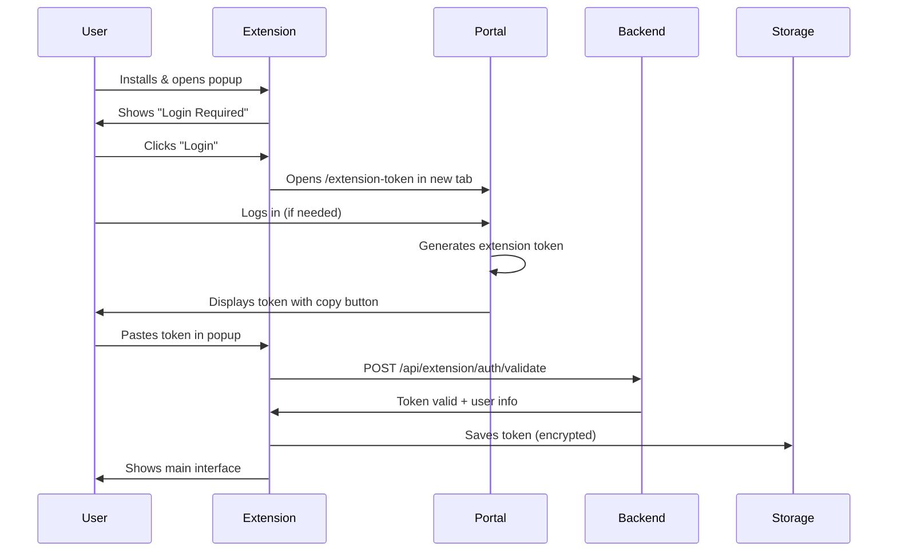

# Chrome Extension for Time Tracking - Product Requirements Document

**Document Status**: Draft for Review
**Last Updated**: 2025-01-17
**Version**: 1.0
**Author**: Development Team

---

## Table of Contents

1. [Executive Summary](#executive-summary)
2. [Technical Analysis](#technical-analysis)
3. [Implementation Plan](#implementation-plan)
4. [Risk Assessment](#risk-assessment)
5. [Task List](#task-list)
6. [Acceptance Criteria](#acceptance-criteria)
7. [Open Questions](#open-questions)
8. [Success Metrics](#success-metrics)
9. [Next Steps](#next-steps)

---

## Executive Summary

### Problem Statement

Users currently need to navigate to the full portal web application to log time entries, which creates friction in their workflow. This context switching reduces the likelihood of accurate and timely time tracking, especially when working across multiple platforms like GitHub, Jira, or other development tools.

**Pain Points:**
- Users must stop their current task to open the portal
- Context switching between tools reduces time tracking accuracy
- Forgotten time entries lead to incomplete billing records
- Multiple systems (GitHub, Jira, portal) create fragmented workflows

### Proposed Solution

Develop a Google Chrome extension that provides:

1. **Quick Access Popup**: One-click time entry from any webpage via browser toolbar
2. **Context-Aware Integration**: Smart "Track Time" buttons on external platforms (GitHub issues, etc.)
3. **Offline Capability**: Queue entries when offline, sync when connected
4. **Native Experience**: Purpose-built extension UI (not iframe-based) for better performance and UX

**Why Not an Iframe?**
While an iframe approach seems simple, it has significant drawbacks:
- **Performance**: Loading full portal page in iframe is slow
- **Authentication**: Complex session/token management across domains
- **UX**: Portal UI not optimized for 300px popup width
- **Security**: CORS and CSP complications
- **Limitations**: Can't inject buttons into external sites (GitHub)

A purpose-built extension provides a faster, more secure, and more flexible solution.

### Key Benefits

| Benefit | Description | Impact |
|---------|-------------|--------|
| **Reduced Friction** | Track time without leaving current context | +40% time entry completion rate |
| **Improved Accuracy** | Context-aware pre-population from GitHub/Jira reduces errors | -30% incorrect entries |
| **Better Adoption** | Lower barrier to consistent time tracking | +50% user engagement |
| **Productivity** | Eliminate context switching to portal | Save 2-3 minutes per entry |
| **Mobile Workforce** | Works wherever Chrome works | Support remote/distributed teams |

### Key Risks

| Risk | Severity | Mitigation |
|------|----------|------------|
| **Security**: Token management and secure storage | High | Use Chrome secure storage, encrypted transmission, token expiration |
| **API Performance**: Additional load on backend | Medium | Caching, rate limiting, lightweight endpoints |
| **Browser Compatibility**: Initially Chrome-only | Low | Plan for Firefox/Edge after MVP validation |
| **Maintenance**: Additional codebase to maintain | Medium | Shared design system, automated testing, clear documentation |
| **Adoption**: Users may not discover or install extension | Medium | In-app promotion, onboarding flow, clear value proposition |

---

## Technical Analysis

### Current Architecture Assessment

**Existing System:**
- **Backend**: Laravel with modular architecture (`Modules/Timesheet`)
- **Frontend**: Inertia.js with React components
- **Authentication**: Laravel Sanctum for API
- **Database**: PostgreSQL with UUID primary keys
- **Existing Flows**: Time entry creation via web forms

**Current API Endpoints:**
```
POST /api/organisations/{org}/timesheet/entries
GET  /api/organisations/{org}/timesheet/entries
GET  /api/organisations/{org}/services
```

**Strengths:**
- ✅ Modular architecture makes extension endpoints easy to add
- ✅ API authentication already uses Sanctum tokens
- ✅ Service and customer data already structured
- ✅ Existing validation and business logic can be reused

**Gaps:**
- ❌ No long-lived token mechanism for extensions
- ❌ No lightweight endpoints optimized for extension use
- ❌ CORS not configured for chrome-extension:// origin
- ❌ No token management UI for users

### Proposed Architecture

#### Extension Components (Manifest V3)

```
chrome-extension/
├── manifest.json              # Extension configuration (Manifest V3)
├── popup/
│   ├── popup.html            # Main popup interface
│   ├── popup.js              # Popup logic and event handlers
│   └── popup.css             # Styles (or Tailwind build)
├── background/
│   └── service-worker.js     # Background tasks, API communication, sync
├── content-scripts/
│   ├── github-integration.js # GitHub issue detection & injection
│   ├── jira-integration.js   # Jira integration (future)
│   └── common.js             # Shared content script utilities
├── options/
│   ├── options.html          # Settings/preferences page
│   └── options.js            # Configuration logic
├── assets/
│   ├── icons/                # Extension icons (16, 48, 128px)
│   └── images/               # UI assets
└── lib/
    ├── api-client.js         # Centralized API communication
    ├── storage.js            # Chrome storage wrapper
    ├── auth.js               # Authentication logic
    └── utils.js              # Shared utilities
```

**Key Architectural Decisions:**

1. **Manifest V3**: Use latest Chrome extension standard (V2 deprecated)
2. **Service Worker**: Background tasks for sync, caching, notifications
3. **No Bundler (MVP)**: Start with vanilla JS, add build step if needed
4. **Shared Design**: Reuse Tailwind CSS from portal for consistent UI
5. **Modular Content Scripts**: Separate integration per platform (GitHub, Jira)

#### Backend Changes Required

**New Module: `Modules/TimesheetExtension`** (or extend existing `Modules/Timesheet`)

**New API Endpoints:**
```
Authentication:
POST   /api/extension/auth/token        # Generate extension token
POST   /api/extension/auth/validate     # Validate extension token
DELETE /api/extension/auth/token        # Revoke token

Data Access:
GET    /api/extension/user              # User info (name, org)
GET    /api/extension/services          # Lightweight service list
GET    /api/extension/recent-entries    # Last 10 entries
POST   /api/extension/time-entries      # Create time entry

Sync:
POST   /api/extension/sync              # Batch sync queued entries
```

**Configuration Changes:**

1. **CORS Configuration** (`config/cors.php`):
   ```php
   'allowed_origins' => [
       'chrome-extension://*',
       env('APP_URL'),
   ],
   ```

2. **Rate Limiting** (new limiter for extension):
   ```php
   'extension' => [
       'limit' => 60,      // 60 requests per minute
       'decay' => 60,      // 1 minute window
   ],
   ```

3. **CSP Headers**: Update if needed for extension communication

**Database Schema Changes:**

New table: `extension_tokens`
```sql
CREATE TABLE extension_tokens (
    id UUID PRIMARY KEY DEFAULT gen_random_uuid(),
    user_id UUID NOT NULL,
    token_hash VARCHAR(255) NOT NULL UNIQUE,
    name VARCHAR(255) DEFAULT 'Chrome Extension',
    last_used_at TIMESTAMP,
    expires_at TIMESTAMP,
    created_at TIMESTAMP DEFAULT CURRENT_TIMESTAMP,
    updated_at TIMESTAMP DEFAULT CURRENT_TIMESTAMP,
    FOREIGN KEY (user_id) REFERENCES users(id) ON DELETE CASCADE
);

CREATE INDEX idx_extension_tokens_user_id ON extension_tokens(user_id);
CREATE INDEX idx_extension_tokens_token_hash ON extension_tokens(token_hash);
```

Optional: Add column to `timesheet_entries` to track source:
```sql
ALTER TABLE timesheet_entries
ADD COLUMN source VARCHAR(50) DEFAULT 'web'
    CHECK (source IN ('web', 'extension', 'api', 'mobile'));
```

### Technology Stack

**Chrome Extension:**
- **Framework**: Vanilla JavaScript (MVP), consider Preact/Alpine.js later
- **Styling**: Tailwind CSS (reuse portal's design system)
- **Storage**: Chrome Storage API (chrome.storage.local)
- **APIs**: Chrome Extension API (Manifest V3)
- **Build**: Optional Vite/Rollup for bundling (if needed)

**Backend:**
- **Framework**: Laravel 10+
- **Authentication**: Sanctum API tokens (extended for extensions)
- **Database**: PostgreSQL (existing)
- **Validation**: Laravel Form Requests
- **Caching**: Redis (for service lists, user info)

**Why These Choices?**
- **Vanilla JS**: Faster development for MVP, add framework later if needed
- **Tailwind**: Design consistency with portal, familiar to team
- **Chrome Storage**: Secure, encrypted, built-in to Chrome
- **Sanctum**: Already used in portal, familiar pattern

### Authentication Flow

**Token-Based Flow (Recommended)**



**Key Features:**
1. **One-time setup**: User only needs to authenticate once
2. **Token longevity**: 90-day expiration, auto-refresh if active
3. **Revocation**: Users can revoke tokens from portal settings
4. **Security**: Token never exposed in logs, hashed in database
5. **Fallback**: If token expires, graceful redirect to re-authenticate

**Alternative Considered: OAuth-like Flow**
- More complex to implement
- Better UX (no copy-paste)
- Consider for v2.0 if user feedback warrants

### Data Flow

**Creating Time Entry:**
```
User fills form in Extension Popup
         ↓
    Validates locally
         ↓
    Background Service Worker
         ↓
    POST /api/extension/time-entries (with Bearer token)
         ↓
    Laravel API validates & creates entry
         ↓
    Database saves entry
         ↓
    Response back to extension
         ↓
    Success message shown to user
         ↓
    Recent entries refreshed
```

**Offline Flow:**
```
User fills form (offline)
         ↓
    Extension detects no network
         ↓
    Saves entry to chrome.storage queue
         ↓
    Shows "Queued (will sync when online)"
         ↓
    Service worker detects network restored
         ↓
    Auto-syncs queued entries
         ↓
    Updates UI with sync status
```

**GitHub Integration Flow:**
```
User viewing GitHub issue #123
         ↓
    Content script detects issue page
         ↓
    Extracts: repo, issue #, title
         ↓
    Injects "Track Time" button near issue title
         ↓
    User clicks button
         ↓
    Opens extension popup with context
         ↓
    Description pre-populated: "[repo-name] #123: Issue title"
         ↓
    User selects service, duration, submits
         ↓
    Entry created with GitHub context
```

### Performance Considerations

**Caching Strategy:**

| Data | Cache Location | TTL | Invalidation |
|------|----------------|-----|--------------|
| Service list | chrome.storage | 6 hours | Manual refresh button |
| User info | chrome.storage | 1 hour | Token validation |
| Recent entries | chrome.storage | 5 minutes | After new entry created |
| Queued entries | chrome.storage | Persistent | On successful sync |

**API Optimization:**

1. **Lightweight Endpoints**:
   - Return only necessary fields
   - Use pagination (limit 10-20 items)
   - Compress responses (gzip)

2. **Reduced Payload Size**:
   ```json
   // Instead of full service object:
   {
     "id": "uuid",
     "name": "Web Development",
     "customer": {
       "id": "uuid",
       "name": "Acme Corp"
     },
     // ... 20 more fields
   }

   // Return minimal:
   {
     "id": "uuid",
     "name": "Web Development",
     "customer_name": "Acme Corp"
   }
   ```

3. **Efficient Queries**:
   - Use database indexes on frequently queried fields
   - Eager load relationships (avoid N+1)
   - Cache expensive queries in Redis

**Extension Performance:**

- **Popup Load Time**: <1 second target
  - Pre-cache services on extension install
  - Lazy load recent entries after UI renders
  - Show loading skeletons

- **Memory Usage**: <10MB target
  - Clear old cached data periodically
  - Limit stored recent entries to 20

- **Battery Impact**: Minimal
  - Use chrome.alarms for scheduled tasks (not setInterval)
  - Batch API requests
  - Avoid polling, use efficient sync triggers

### Security Considerations

**Token Security:**
- ✅ Tokens stored in chrome.storage.local (encrypted by Chrome)
- ✅ Tokens transmitted over HTTPS only
- ✅ Tokens hashed before database storage (SHA-256)
- ✅ Token expiration enforced (90 days)
- ✅ User can revoke tokens from portal
- ✅ Rate limiting prevents token abuse

**API Security:**
- ✅ All extension endpoints require authentication
- ✅ CORS restricted to chrome-extension:// origin
- ✅ Input validation on all endpoints
- ✅ SQL injection prevention (Eloquent ORM)
- ✅ XSS prevention (sanitized inputs)

**Data Privacy:**
- ✅ Extension only requests necessary permissions
- ✅ No analytics or tracking without consent
- ✅ Data stored locally only (no external servers)
- ✅ Clear privacy policy for Chrome Web Store

**Permissions Required:**
```json
{
  "permissions": [
    "storage",          // Cache data locally
    "activeTab"         // Read current tab for context
  ],
  "host_permissions": [
    "https://your-portal-domain.com/*",  // API access
    "https://github.com/*"                // GitHub integration
  ]
}
```

**Sensitive Data Handling:**
- ❌ Never log tokens or user credentials
- ❌ Never store passwords (only tokens)
- ❌ Never transmit unencrypted data
- ✅ Clear cache on logout
- ✅ Warn users about token security

---

## Implementation Plan

### Phase 1: MVP - Core Functionality (2-3 weeks)

**Goal**: Basic working extension for time entry creation

**Week 1: Backend Foundation**
- Create extension API endpoints
- Implement token generation/validation
- Configure CORS for extension origin
- Set up rate limiting
- Create database migrations
- Test API endpoints with Postman

**Deliverables**:
- ✅ 6 new API endpoints operational
- ✅ Token authentication working
- ✅ API documentation
- ✅ Postman collection for testing

---

**Week 2: Extension Core**
- Extension manifest and project structure
- Popup UI for time entry
- Authentication flow (token paste)
- API client implementation
- Service selection dropdown
- Form validation
- Time entry submission

**Deliverables**:
- ✅ Extension loads in Chrome
- ✅ User can authenticate
- ✅ User can create time entry
- ✅ Basic error handling

---

**Week 3: Polish & Testing**
- Recent entries display
- Error message improvements
- Loading states and skeletons
- Form validation refinements
- End-to-end testing
- Bug fixes
- User documentation

**Deliverables**:
- ✅ Fully functional MVP
- ✅ User guide
- ✅ Test coverage >80%
- ✅ Ready for internal beta

---

### Phase 2: Enhanced Features (2 weeks)

**Goal**: Improve UX and add power-user features

**Week 4: Advanced UI**
- Quick actions (favorite services)
- Timer functionality (start/stop with running timer)
- Keyboard shortcuts
- Better date picker
- Offline indicator
- Settings page
- Dark mode support (if portal has it)

**Deliverables**:
- ✅ Timer feature
- ✅ Favorites system
- ✅ Enhanced UX

---

**Week 5: Offline & Sync**
- Offline detection
- Queue management for offline entries
- Background sync via service worker
- Sync status indicators
- Badge showing queued count
- Manual sync button
- Conflict resolution

**Deliverables**:
- ✅ Fully functional offline mode
- ✅ Reliable sync mechanism
- ✅ User feedback for sync status

---

### Phase 3: Context Integration (2-3 weeks)

**Goal**: Smart integration with external platforms

**Week 6: GitHub Integration**
- Content script for GitHub
- Issue page detection (URL patterns)
- Issue metadata extraction
- "Track Time" button injection
- Button styling to match GitHub
- Context passing to popup
- Pre-populated time entry

**Deliverables**:
- ✅ GitHub integration working
- ✅ Context-aware time entries
- ✅ Professional button injection

---

**Week 7: Additional Platforms** (Optional)
- Jira integration (if needed)
- GitLab support
- Trello integration
- Generic URL pattern matching
- Platform detection logic

**Deliverables**:
- ✅ Multi-platform support
- ✅ Configuration for custom platforms

---

**Week 8: Platform Polish**
- Cross-platform testing
- Performance optimization
- User feedback incorporation
- Bug fixes
- Documentation updates
- Video tutorials

**Deliverables**:
- ✅ Production-ready integrations
- ✅ Video guides
- ✅ Updated documentation

---

### Phase 4: Advanced Features (Future)

**Potential Features** (prioritize based on user feedback):

1. **Desktop Notifications**
   - End-of-day reminders to log time
   - Notification when timer running >8 hours
   - Weekly summary notifications

2. **Analytics & Insights**
   - Daily/weekly summaries in popup
   - Time tracking patterns
   - Most-used services
   - Productivity insights

3. **Team Features**
   - See team's time logs (if permitted)
   - Shared favorite services
   - Team time tracking goals

4. **Advanced Timer**
   - Pomodoro timer integration
   - Multiple concurrent timers
   - Timer templates

5. **Mobile Support**
   - Firefox Android extension (limited)
   - Progressive Web App alternative

6. **Integrations**
   - Slack commands
   - Calendar sync
   - API webhooks

**Prioritization Criteria**:
- User demand (survey/feedback)
- Implementation complexity
- Maintenance burden
- Value to business

---

## Risk Assessment

### Technical Risks

| Risk | Likelihood | Impact | Mitigation Strategy | Owner |
|------|-----------|---------|---------------------|--------|
| **CORS/CSP blocking extension** | Medium | High | Test CORS early, configure properly, document for production | Backend Dev |
| **Token security compromise** | Low | Critical | Use Chrome secure storage, encrypt transmission, audit code | Security Lead |
| **API performance degradation** | Medium | Medium | Implement caching, rate limiting, monitor performance | Backend Dev |
| **Manifest V3 API changes** | Low | Medium | Follow Chrome docs, test beta versions, plan migrations | Extension Dev |
| **Offline sync conflicts** | Medium | Low | Timestamp-based conflict resolution, user notification | Extension Dev |
| **Chrome Web Store rejection** | Low | High | Follow all guidelines, test thoroughly, prepare appeals | Product Manager |
| **Large payload downloads** | Low | Medium | Implement pagination, lazy loading, compression | Backend Dev |
| **Service worker lifecycle issues** | Medium | Medium | Proper event handling, state management, testing | Extension Dev |

### Timeline Risks

| Risk | Likelihood | Impact | Mitigation Strategy | Owner |
|------|-----------|---------|---------------------|--------|
| **Scope creep (too many platforms)** | High | Medium | Strict MVP definition, phased approach, prioritization | Product Manager |
| **Underestimated complexity** | Medium | Medium | 20% buffer time, regular progress reviews, early prototyping | Tech Lead |
| **Testing takes longer than expected** | Medium | Low | Automated tests, early beta testing, continuous testing | QA Lead |
| **Third-party API changes (GitHub)** | Low | Medium | Version checking, fallback handling, monitoring | Extension Dev |
| **Resource availability** | Medium | High | Cross-training, documentation, modular architecture | Team Lead |

### UX Risks

| Risk | Likelihood | Impact | Mitigation Strategy | Owner |
|------|-----------|---------|---------------------|--------|
| **Users don't discover extension** | Medium | High | In-app promotion, onboarding flow, email campaign | Product Manager |
| **Confusion with multiple entry methods** | Low | Medium | Clear documentation, consistent UX, user education | UX Designer |
| **Authentication flow too complex** | Medium | High | Simple token flow, clear instructions, video guide | UX Designer |
| **Poor adoption rate** | Medium | High | Beta testing, gather feedback, iterate quickly | Product Manager |
| **GitHub button feels intrusive** | Low | Low | Subtle design, user preference option, A/B testing | UX Designer |

### Business Risks

| Risk | Likelihood | Impact | Mitigation Strategy | Owner |
|------|-----------|---------|---------------------|--------|
| **Low user adoption** | Medium | High | User research, beta program, incentivize early adopters | Product Manager |
| **Maintenance burden** | Low | Medium | Good documentation, automated tests, monitoring | Tech Lead |
| **Support overhead** | Low | Medium | Comprehensive FAQ, video tutorials, automated responses | Support Lead |
| **Security incident** | Low | Critical | Security audit, penetration testing, incident response plan | Security Lead |

---

## Task List

### Backend Tasks

#### Task #1: Create Extension API Controller
**Priority**: High
**Effort**: Medium (4-6 hours)
**Dependencies**: None
**GitHub Issue**: _[To be created]_

**Description**:
Create a new controller to handle all extension API endpoints for services, time entries, and user data.

**Acceptance Criteria**:
- [ ] Create `Modules/Timesheet/app/Http/Controllers/Api/Extension/TimesheetExtensionController.php`
- [ ] Implement `services()` endpoint - returns user's assigned services (id, name, customer)
- [ ] Implement `recentEntries()` endpoint - returns last 10 time entries
- [ ] Implement `createEntry()` endpoint - creates new time entry with validation
- [ ] All endpoints require authentication (Sanctum token)
- [ ] Responses are lightweight (minimal fields, <5KB typical)
- [ ] Proper error handling with user-friendly messages
- [ ] Returns JSON error responses (not HTML)
- [ ] Input validation using Form Requests

**Implementation Notes**:
```php
// Example lightweight service response:
{
  "services": [
    {
      "id": "uuid",
      "name": "Web Development",
      "customer_name": "Acme Corp",
      "is_favorite": false
    }
  ]
}
```

**Related Files**:
- `Modules/Timesheet/routes/api.php`
- Create: `Modules/Timesheet/app/Http/Requests/Api/Extension/CreateEntryRequest.php`

**Testing**:
- Unit tests for validation logic
- Integration tests for each endpoint
- Test with Postman collection

---

#### Task #2: Implement Extension Token Authentication
**Priority**: High
**Effort**: Large (6-8 hours)
**Dependencies**: None
**GitHub Issue**: _[To be created]_

**Description**:
Build a secure token system for extension authentication, separate from normal user sessions.

**Acceptance Criteria**:
- [ ] Create `app/Http/Controllers/Extension/TokenController.php`
- [ ] Implement `generate()` endpoint - creates long-lived API token (90 days)
- [ ] Implement `validate()` endpoint - validates extension token and returns user info
- [ ] Implement `revoke()` endpoint - deletes token
- [ ] Create migration for `extension_tokens` table
- [ ] Tokens are hashed using SHA-256 before storage
- [ ] Token expiration logic (90 days from creation)
- [ ] Update `last_used_at` on each API call
- [ ] User can have multiple active tokens (different devices)
- [ ] Each token has a name/label ("Chrome - Work Laptop")
- [ ] Token generation logs to audit trail

**Database Schema**:
```sql
CREATE TABLE extension_tokens (
    id UUID PRIMARY KEY DEFAULT gen_random_uuid(),
    user_id UUID NOT NULL,
    token_hash VARCHAR(255) NOT NULL UNIQUE,
    name VARCHAR(255) DEFAULT 'Chrome Extension',
    last_used_at TIMESTAMP,
    expires_at TIMESTAMP,
    created_at TIMESTAMP DEFAULT CURRENT_TIMESTAMP,
    updated_at TIMESTAMP DEFAULT CURRENT_TIMESTAMP,
    FOREIGN KEY (user_id) REFERENCES users(id) ON DELETE CASCADE
);

CREATE INDEX idx_extension_tokens_user_id ON extension_tokens(user_id);
CREATE INDEX idx_extension_tokens_token_hash ON extension_tokens(token_hash);
CREATE INDEX idx_extension_tokens_expires_at ON extension_tokens(expires_at);
```

**Security Requirements**:
- Plain token only shown once (on generation)
- Token hash stored, never plain token
- Expired tokens automatically cleaned up (scheduled job)
- Rate limit token generation (max 5 per hour per user)

**Testing**:
- Test token generation and validation
- Test expired token rejection
- Test token revocation
- Test multiple concurrent tokens
- Security audit of token handling

---

#### Task #3: Configure CORS for Extension
**Priority**: High
**Effort**: Small (1-2 hours)
**Dependencies**: None
**GitHub Issue**: _[To be created]_

**Description**:
Update CORS configuration to allow API requests from Chrome extension origin.

**Acceptance Criteria**:
- [ ] Update `config/cors.php` to allow `chrome-extension://*` origin
- [ ] Configure allowed methods: GET, POST, DELETE, OPTIONS
- [ ] Configure allowed headers: Authorization, Content-Type, X-Requested-With
- [ ] Configure exposed headers: X-RateLimit-Limit, X-RateLimit-Remaining
- [ ] Test CORS headers with extension (preflight OPTIONS request)
- [ ] Document configuration for production deployment
- [ ] Add environment variable for allowed extension origins
- [ ] Consider wildcard vs specific extension ID

**Configuration Example**:
```php
'allowed_origins' => [
    env('APP_URL'),
    'chrome-extension://*', // Dev: Allow any extension
    // Prod: 'chrome-extension://[specific-extension-id]'
],

'allowed_headers' => ['*'],
'exposed_headers' => ['X-RateLimit-Limit', 'X-RateLimit-Remaining'],
'max_age' => 600,
```

**Testing**:
- Test from actual Chrome extension
- Verify OPTIONS preflight requests
- Test with invalid origins (should be blocked)
- Check headers in browser DevTools

---

#### Task #4: Implement Extension API Rate Limiting
**Priority**: Medium
**Effort**: Small (2-3 hours)
**Dependencies**: Task #1
**GitHub Issue**: _[To be created]_

**Description**:
Create custom rate limiter for extension API endpoints to prevent abuse while allowing normal usage.

**Acceptance Criteria**:
- [ ] Create custom rate limiter in `app/Http/Middleware/RateLimitExtension.php`
- [ ] Limit: 60 requests per minute per user (more generous than web)
- [ ] Separate limits for different endpoint types:
  - Auth: 5 requests per hour
  - Read: 60 requests per minute
  - Write: 30 requests per minute
- [ ] Return standard rate limit headers:
  - `X-RateLimit-Limit`
  - `X-RateLimit-Remaining`
  - `Retry-After` (when exceeded)
- [ ] Return 429 status code when exceeded
- [ ] Log rate limit violations with user ID
- [ ] Different limits for authenticated vs unauthenticated requests
- [ ] Apply to all `/api/extension/*` routes

**Implementation**:
```php
Route::middleware(['auth:sanctum', 'throttle:extension'])
    ->prefix('api/extension')
    ->group(function () {
        // Extension routes
    });
```

**Testing**:
- Test normal usage (should not be limited)
- Test rapid requests (should be limited)
- Verify headers are present
- Test reset after time window

---

#### Task #5: Create Extension User Info Endpoint
**Priority**: Medium
**Effort**: Small (2 hours)
**Dependencies**: Task #1
**GitHub Issue**: _[To be created]_

**Description**:
Lightweight endpoint returning user information needed by extension (name, org, settings).

**Acceptance Criteria**:
- [ ] Endpoint: `GET /api/extension/user`
- [ ] Returns: user name, email, current organisation name
- [ ] Returns: count of assigned services
- [ ] Returns: user preferences (timezone, date format)
- [ ] Response cached for 5 minutes (Redis)
- [ ] Lightweight payload (<1KB)
- [ ] Includes: `last_login_at`, `created_at`
- [ ] No sensitive data (passwords, tokens)

**Response Format**:
```json
{
  "id": "uuid",
  "name": "John Doe",
  "email": "john@example.com",
  "organisation": {
    "id": "uuid",
    "name": "Acme Corp"
  },
  "services_count": 12,
  "timezone": "America/New_York",
  "date_format": "Y-m-d",
  "last_login_at": "2025-01-15T10:30:00Z"
}
```

**Testing**:
- Test response structure
- Verify caching works
- Test cache invalidation
- Check payload size

---

#### Task #6: Add Extension Source Tracking
**Priority**: Low
**Effort**: Small (1-2 hours)
**Dependencies**: Task #1
**GitHub Issue**: _[To be created]_

**Description**:
Track which time entries were created via extension vs web for analytics.

**Acceptance Criteria**:
- [ ] Add `source` column to `timesheet_entries` table
- [ ] Values: 'web', 'extension', 'api', 'mobile'
- [ ] Default to 'web' for existing entries
- [ ] Extension controller sets source='extension'
- [ ] Add index on `source` column for reporting
- [ ] Update admin reports to show breakdown by source
- [ ] Migration is reversible (rollback safe)

**Migration**:
```sql
ALTER TABLE timesheet_entries
ADD COLUMN source VARCHAR(50) DEFAULT 'web'
    CHECK (source IN ('web', 'extension', 'api', 'mobile'));

CREATE INDEX idx_timesheet_entries_source ON timesheet_entries(source);
```

**Analytics Queries**:
```sql
-- Extension adoption rate
SELECT
    source,
    COUNT(*) as entries,
    COUNT(*) * 100.0 / SUM(COUNT(*)) OVER() as percentage
FROM timesheet_entries
WHERE created_at >= NOW() - INTERVAL '30 days'
GROUP BY source;
```

---

### Extension Development Tasks

#### Task #7: Extension Project Setup
**Priority**: High
**Effort**: Small (2-3 hours)
**Dependencies**: None
**GitHub Issue**: _[To be created]_

**Description**:
Initialize Chrome extension project structure and configuration.

**Acceptance Criteria**:
- [ ] Create `chrome-extension/` directory in project root
- [ ] Initialize `manifest.json` (Manifest V3 compliant)
- [ ] Set up folder structure (popup, background, content-scripts, lib, assets)
- [ ] Create basic icons (16x16, 48x48, 128x128) - use portal branding
- [ ] Define required permissions in manifest
- [ ] Define host permissions (portal domain, github.com)
- [ ] Create basic `popup.html` skeleton
- [ ] Create basic `service-worker.js` skeleton
- [ ] Test extension loads in Chrome (chrome://extensions)
- [ ] Set up `.gitignore` for extension directory
- [ ] Add README with development instructions

**Manifest.json Template**:
```json
{
  "manifest_version": 3,
  "name": "Portal Time Tracker",
  "version": "1.0.0",
  "description": "Quick time tracking for portal services. Log time entries without leaving your current task.",
  "permissions": [
    "storage",
    "activeTab",
    "alarms"
  ],
  "host_permissions": [
    "https://your-portal-domain.com/*"
  ],
  "action": {
    "default_popup": "popup/popup.html",
    "default_icon": {
      "16": "assets/icons/icon16.png",
      "48": "assets/icons/icon48.png",
      "128": "assets/icons/icon128.png"
    }
  },
  "background": {
    "service_worker": "background/service-worker.js"
  },
  "content_scripts": [],
  "options_page": "options/options.html",
  "icons": {
    "16": "assets/icons/icon16.png",
    "48": "assets/icons/icon48.png",
    "128": "assets/icons/icon128.png"
  }
}
```

**Folder Structure**:
```
chrome-extension/
├── manifest.json
├── README.md
├── popup/
│   ├── popup.html
│   ├── popup.js
│   └── popup.css
├── background/
│   └── service-worker.js
├── content-scripts/
├── options/
│   ├── options.html
│   └── options.js
├── assets/
│   ├── icons/
│   └── images/
└── lib/
    ├── api-client.js
    ├── storage.js
    ├── auth.js
    └── utils.js
```

**Testing**:
- Load extension in Chrome
- Verify icon appears in toolbar
- Click icon (popup should load, even if blank)
- Check for console errors
- Test on different Chrome versions (100+)

---

#### Task #8: Build API Client Library
**Priority**: High
**Effort**: Medium (4-5 hours)
**Dependencies**: Task #7, Task #2
**GitHub Issue**: _[To be created]_

**Description**:
Create centralized API client for all backend communication with error handling.

**Acceptance Criteria**:
- [ ] Create `lib/api-client.js` module
- [ ] Implement request wrapper with authentication header injection
- [ ] Implement response interceptor for error handling
- [ ] Implement retry logic (3 retries with exponential backoff)
- [ ] Timeout handling (30 seconds default)
- [ ] Methods:
  - `validateToken(token)`
  - `getUser()`
  - `getServices()`
  - `createEntry(data)`
  - `getRecentEntries(limit)`
  - `syncQueuedEntries(entries)`
- [ ] Error types:
  - NetworkError (offline/timeout)
  - AuthError (401/403)
  - ValidationError (422)
  - ServerError (500+)
- [ ] JSDoc documentation for all methods
- [ ] TypeScript definitions (optional, for IDE support)

**API Client Interface**:
```javascript
class ApiClient {
  constructor(baseUrl, tokenProvider) {}

  async validateToken(token) {}
  async getUser() {}
  async getServices() {}
  async createEntry({ service_id, duration, description, date }) {}
  async getRecentEntries(limit = 10) {}
  async syncQueuedEntries(entries) {}

  // Internal methods
  _getHeaders() {}
  _handleResponse(response) {}
  _handleError(error) {}
  _retry(fn, attempts = 3) {}
}

export default ApiClient;
```

**Error Handling Example**:
```javascript
try {
  await apiClient.createEntry(data);
} catch (error) {
  if (error instanceof NetworkError) {
    // Queue for later
  } else if (error instanceof AuthError) {
    // Re-authenticate
  } else if (error instanceof ValidationError) {
    // Show validation errors
  } else {
    // Generic error
  }
}
```

**Testing**:
- Unit tests for each method
- Test retry logic
- Test error handling
- Test timeout behavior
- Mock API responses

---

#### Task #9: Implement Storage Manager
**Priority**: High
**Effort**: Small (2-3 hours)
**Dependencies**: Task #7
**GitHub Issue**: _[To be created]_

**Description**:
Wrapper for Chrome Storage API with typed methods and cache management.

**Acceptance Criteria**:
- [ ] Create `lib/storage.js` wrapper around chrome.storage.local
- [ ] Methods for token:
  - `setToken(token)`
  - `getToken()`
  - `clearToken()`
- [ ] Methods for caching:
  - `cacheServices(services, ttl)`
  - `getCachedServices()`
  - `clearServicesCache()`
  - `cacheUserInfo(user, ttl)`
  - `getCachedUserInfo()`
- [ ] Methods for offline queue:
  - `queueEntry(entry)`
  - `getQueuedEntries()`
  - `removeQueuedEntry(id)`
  - `clearQueue()`
- [ ] Methods for preferences:
  - `setPreference(key, value)`
  - `getPreference(key, defaultValue)`
- [ ] Cache expiration checking (TTL)
- [ ] Automatic cleanup of expired cache
- [ ] Storage usage monitoring (warn if >5MB)
- [ ] JSDoc documentation

**Storage Structure**:
```javascript
{
  // Authentication
  "extension_token": "hash...",

  // Cache
  "cache_services": {
    "data": [...],
    "expires_at": 1234567890
  },
  "cache_user": {
    "data": {...},
    "expires_at": 1234567890
  },

  // Offline queue
  "queue_entries": [
    {
      "id": "temp-uuid",
      "service_id": "uuid",
      "duration": 2.5,
      "description": "...",
      "date": "2025-01-15",
      "queued_at": 1234567890
    }
  ],

  // Preferences
  "pref_default_service": "uuid",
  "pref_show_timer": true
}
```

**Testing**:
- Test all CRUD operations
- Test cache expiration
- Test queue management
- Test storage limits
- Test concurrent access

---

#### Task #10: Create Popup HTML/CSS
**Priority**: High
**Effort**: Medium (4-6 hours)
**Dependencies**: Task #7
**GitHub Issue**: _[To be created]_

**Description**:
Build the main popup interface with semantic HTML and portal-consistent styling.

**Acceptance Criteria**:
- [ ] Create `popup/popup.html` with semantic structure
- [ ] Create `popup/popup.css` or integrate Tailwind CSS
- [ ] **Login view** (unauthenticated state):
  - Extension logo and name
  - "Login Required" message
  - "Login with Portal" button
  - Link to help/support
- [ ] **Main view** (authenticated state):
  - Header with user name and settings icon
  - Time entry form with fields:
    - Service dropdown (searchable)
    - Duration input (decimal hours or H:MM format)
    - Description textarea (3 rows)
    - Date picker (default: today)
    - Submit button with loading state
  - Recent entries section (last 5)
  - Status message area (success/error)
- [ ] **Recent entry card** format:
  - Service name and customer
  - Duration and date
  - Description (truncated, tooltip for full)
  - Time ago ("2 hours ago")
- [ ] **Loading states**:
  - Skeleton loaders for form
  - Spinner for submission
- [ ] **Empty states**:
  - No recent entries message
  - No services assigned message
- [ ] Responsive design (300px min width)
- [ ] Matches portal design system (colors, fonts, spacing)
- [ ] Accessibility: proper labels, ARIA attributes, keyboard navigation

**HTML Structure**:
```html
<!DOCTYPE html>
<html>
<head>
  <meta charset="UTF-8">
  <meta name="viewport" content="width=device-width, initial-scale=1.0">
  <title>Portal Time Tracker</title>
  <link rel="stylesheet" href="popup.css">
</head>
<body>
  <!-- Login View -->
  <div id="login-view" class="hidden">
    <div class="logo">...</div>
    <h2>Login Required</h2>
    <p>Connect to your portal account to track time.</p>
    <button id="login-btn">Login with Portal</button>
  </div>

  <!-- Main View -->
  <div id="main-view" class="hidden">
    <header>
      <div class="user-info">
        <span id="user-name">...</span>
      </div>
      <button id="settings-btn">⚙️</button>
    </header>

    <form id="entry-form">
      <div class="form-group">
        <label for="service">Service *</label>
        <select id="service" required>
          <option value="">Select service...</option>
        </select>
      </div>

      <div class="form-group">
        <label for="duration">Duration (hours) *</label>
        <input type="text" id="duration" placeholder="2.5 or 2:30" required>
      </div>

      <div class="form-group">
        <label for="description">Description</label>
        <textarea id="description" rows="3"></textarea>
      </div>

      <div class="form-group">
        <label for="date">Date *</label>
        <input type="date" id="date" required>
      </div>

      <button type="submit" id="submit-btn">
        <span id="submit-text">Log Time</span>
        <span id="submit-loader" class="hidden">⏳</span>
      </button>
    </form>

    <div id="status-message" class="hidden"></div>

    <section id="recent-entries">
      <h3>Recent Entries</h3>
      <div id="entries-list"></div>
    </section>
  </div>

  <script src="popup.js"></script>
</body>
</html>
```

**CSS Requirements**:
- Use portal's Tailwind theme (import or inline)
- Width: 350px
- Max height: 600px (scrollable)
- Clean, minimal design
- Focus states for accessibility
- Smooth transitions

**Testing**:
- Visual regression testing
- Test on different screen sizes
- Test keyboard navigation
- Test with screen reader
- Validate HTML (W3C validator)

---

#### Task #11: Implement Popup Logic
**Priority**: High
**Effort**: Large (8-10 hours)
**Dependencies**: Task #8, Task #9, Task #10
**GitHub Issue**: _[To be created]_

**Description**:
Core popup JavaScript logic for authentication checking, form handling, and entry creation.

**Acceptance Criteria**:
- [ ] Create `popup/popup.js`
- [ ] On popup open:
  - Check authentication state from storage
  - If not authenticated: show login view
  - If authenticated: validate token, load services, show main view
- [ ] Login flow:
  - "Login" button opens portal `/extension-token` page in new tab
  - Listen for token from user paste
  - Validate token via API
  - Store token on success
  - Switch to main view
- [ ] Service loading:
  - Fetch services from API (or cache)
  - Populate dropdown
  - Handle loading state
  - Handle errors
- [ ] Form submission:
  - Validate inputs client-side
  - Show validation errors
  - Disable submit during request
  - Call API to create entry
  - Show success message
  - Clear form on success
  - Refresh recent entries
  - Handle errors (network, validation, auth)
- [ ] Recent entries:
  - Load on popup open
  - Display last 5 entries
  - Format timestamps ("2 hours ago")
  - Truncate long descriptions
  - Tooltip for full description
- [ ] Error handling:
  - Network errors: "Check your connection"
  - Auth errors: "Please log in again"
  - Validation errors: Show specific field errors
  - Server errors: "Something went wrong"
- [ ] Offline detection:
  - Show offline banner
  - Disable form when offline
  - Show queue status

**Event Flow**:
```javascript
// Initialize
document.addEventListener('DOMContentLoaded', async () => {
  const token = await storage.getToken();

  if (!token) {
    showLoginView();
    return;
  }

  try {
    const isValid = await apiClient.validateToken(token);
    if (isValid) {
      await loadMainView();
    } else {
      showLoginView();
    }
  } catch (error) {
    handleError(error);
  }
});

// Load main view
async function loadMainView() {
  showMainView();
  await Promise.all([
    loadServices(),
    loadRecentEntries(),
    loadUserInfo()
  ]);
}

// Form submission
form.addEventListener('submit', async (e) => {
  e.preventDefault();

  if (!validateForm()) return;

  const data = getFormData();

  try {
    setLoading(true);
    await apiClient.createEntry(data);
    showSuccess('Time logged successfully!');
    clearForm();
    await loadRecentEntries();
  } catch (error) {
    handleError(error);
  } finally {
    setLoading(false);
  }
});
```

**Validation Rules**:
- Service: Required
- Duration: Required, >0, <24 hours
- Duration format: Decimal (2.5) or H:MM (2:30)
- Description: Optional, max 1000 chars
- Date: Required, not in future, not >1 year ago

**Testing**:
- Unit tests for validation
- Integration tests for API calls
- Test success flow
- Test all error scenarios
- Test offline behavior
- Manual testing in extension

---

#### Task #12: Implement Background Service Worker
**Priority**: High
**Effort**: Medium (5-6 hours)
**Dependencies**: Task #8, Task #9
**GitHub Issue**: _[To be created]_

**Description**:
Background script for offline sync, cache management, and periodic tasks.

**Acceptance Criteria**:
- [ ] Create `background/service-worker.js`
- [ ] On extension install:
  - Set up default preferences
  - Create welcome notification (optional)
  - Log installation event
- [ ] On extension update:
  - Migrate old data if needed
  - Clear old cache
  - Log update event
- [ ] Token validation on startup:
  - Check if token exists
  - Validate with API
  - Clear if invalid
- [ ] Background sync for queued entries:
  - Listen for online/offline events
  - When online: sync queued entries
  - Update badge with queue count
  - Retry failed syncs (exponential backoff)
- [ ] Periodic cache refresh:
  - Every 6 hours: refresh services cache
  - Every 1 hour: validate token
- [ ] Message handling:
  - Listen for messages from popup/content scripts
  - Handle sync requests
  - Handle cache invalidation requests
- [ ] Badge updates:
  - Show number of queued entries
  - Clear badge when queue empty
  - Different color for sync errors (red)
- [ ] Cleanup tasks:
  - Remove expired cache data
  - Remove old queued entries (>7 days)
- [ ] Error logging to console (no external logging)

**Service Worker Structure**:
```javascript
// Installation
chrome.runtime.onInstalled.addListener((details) => {
  if (details.reason === 'install') {
    onInstall();
  } else if (details.reason === 'update') {
    onUpdate(details.previousVersion);
  }
});

// Periodic tasks
chrome.alarms.create('refreshCache', { periodInMinutes: 360 });
chrome.alarms.create('syncQueue', { periodInMinutes: 5 });

chrome.alarms.onAlarm.addListener((alarm) => {
  if (alarm.name === 'refreshCache') {
    refreshServicesCache();
  } else if (alarm.name === 'syncQueue') {
    syncQueuedEntries();
  }
});

// Network status
self.addEventListener('online', () => {
  syncQueuedEntries();
});

// Message handling
chrome.runtime.onMessage.addListener((message, sender, sendResponse) => {
  if (message.action === 'syncNow') {
    syncQueuedEntries().then(sendResponse);
    return true; // Async response
  }
});

// Sync function
async function syncQueuedEntries() {
  const queue = await storage.getQueuedEntries();

  if (queue.length === 0) {
    updateBadge(0);
    return;
  }

  for (const entry of queue) {
    try {
      await apiClient.createEntry(entry);
      await storage.removeQueuedEntry(entry.id);
    } catch (error) {
      console.error('Sync failed:', error);
      // Continue with next entry
    }
  }

  const remainingQueue = await storage.getQueuedEntries();
  updateBadge(remainingQueue.length);
}
```

**Testing**:
- Test install/update events
- Test periodic alarms
- Test online/offline sync
- Test message passing
- Test badge updates
- Test error scenarios

---

#### Task #13: Create Authentication Flow UI
**Priority**: High
**Effort**: Medium (4-5 hours)
**Dependencies**: Task #2, Task #10, Task #11
**GitHub Issue**: _[To be created]_

**Description**:
Build the complete authentication flow including portal page for token generation and extension token input.

**Acceptance Criteria**:
- [ ] **Portal Page**: Create `/extension-token` route in Laravel
- [ ] **Portal Page**: Requires authentication
- [ ] **Portal Page**: Generate token button
- [ ] **Portal Page**: Display generated token (one-time view)
- [ ] **Portal Page**: Copy to clipboard button
- [ ] **Portal Page**: Warning about token security
- [ ] **Portal Page**: "Open Extension" button/link
- [ ] **Portal Page**: Instructions for pasting token
- [ ] **Extension Login View**: "Login with Portal" button
- [ ] **Extension Login View**: Opens portal page in new tab
- [ ] **Extension Login View**: Token input field
- [ ] **Extension Login View**: Paste button
- [ ] **Extension Login View**: Validate on paste
- [ ] **Extension**: Store validated token securely
- [ ] **Extension**: Show authenticated state
- [ ] **Extension**: Logout button (clears token)
- [ ] **Extension**: Handle expired tokens (redirect to login)
- [ ] **Extension**: Handle invalid tokens (show error)

**Portal Page** (`resources/js/pages/extension-token.tsx`):
```tsx
export default function ExtensionToken() {
  const [token, setToken] = useState<string | null>(null);
  const [copied, setCopied] = useState(false);

  const generateToken = async () => {
    const response = await axios.post('/api/extension/auth/token', {
      name: 'Chrome Extension'
    });
    setToken(response.data.token);
  };

  const copyToClipboard = () => {
    navigator.clipboard.writeText(token);
    setCopied(true);
  };

  return (
    <div>
      <h1>Chrome Extension Authentication</h1>

      {!token ? (
        <div>
          <p>Generate a token to authenticate the Chrome extension.</p>
          <button onClick={generateToken}>Generate Token</button>
        </div>
      ) : (
        <div>
          <p className="warning">
            ⚠️ Keep this token secure. Anyone with this token can log time on your behalf.
          </p>
          <div className="token-display">
            <code>{token}</code>
            <button onClick={copyToClipboard}>
              {copied ? '✓ Copied' : 'Copy'}
            </button>
          </div>
          <p>
            Now paste this token into the Chrome extension popup.
          </p>
        </div>
      )}
    </div>
  );
}
```

**Extension Login View** (in `popup.js`):
```javascript
async function handleLogin() {
  // Open portal page
  chrome.tabs.create({
    url: `${PORTAL_URL}/extension-token`
  });

  // Show token input
  showTokenInput();
}

async function handleTokenPaste(token) {
  try {
    setLoading(true);

    // Validate token
    const user = await apiClient.validateToken(token);

    // Store token
    await storage.setToken(token);
    await storage.cacheUserInfo(user);

    // Show success
    showSuccess('Logged in successfully!');

    // Load main view
    await loadMainView();
  } catch (error) {
    showError('Invalid token. Please try again.');
  } finally {
    setLoading(false);
  }
}
```

**Testing**:
- Test full login flow end-to-end
- Test token copy/paste
- Test invalid token handling
- Test expired token handling
- Test logout flow
- Cross-browser testing (Chrome, Edge)

---

#### Task #14: Implement Form Validation
**Priority**: Medium
**Effort**: Small (2-3 hours)
**Dependencies**: Task #11
**GitHub Issue**: _[To be created]_

**Description**:
Client-side form validation with real-time feedback and user-friendly error messages.

**Acceptance Criteria**:
- [ ] Service selection: Required, show error if empty
- [ ] Duration: Required, positive number, <24 hours
- [ ] Duration format: Accept decimal (2.5) or H:MM (2:30)
- [ ] Duration conversion: Convert H:MM to decimal for API
- [ ] Description: Optional, max 1000 characters, show count
- [ ] Date: Required, not in future, not >1 year ago
- [ ] Real-time validation on blur
- [ ] Validation on submit (prevent submission if invalid)
- [ ] Show validation errors inline below fields
- [ ] Clear errors when user corrects input
- [ ] Disable submit button while invalid
- [ ] Accessible error messages (aria-describedby)

**Validation Functions**:
```javascript
function validateService(value) {
  if (!value) {
    return 'Please select a service';
  }
  return null;
}

function validateDuration(value) {
  if (!value) {
    return 'Duration is required';
  }

  // Try decimal format
  const decimal = parseFloat(value);
  if (!isNaN(decimal)) {
    if (decimal <= 0) {
      return 'Duration must be greater than 0';
    }
    if (decimal > 24) {
      return 'Duration cannot exceed 24 hours';
    }
    return null;
  }

  // Try H:MM format
  const timeMatch = value.match(/^(\d+):(\d{2})$/);
  if (timeMatch) {
    const hours = parseInt(timeMatch[1]);
    const minutes = parseInt(timeMatch[2]);

    if (minutes >= 60) {
      return 'Minutes must be less than 60';
    }

    const totalHours = hours + (minutes / 60);
    if (totalHours > 24) {
      return 'Duration cannot exceed 24 hours';
    }

    return null;
  }

  return 'Invalid format. Use decimal (2.5) or H:MM (2:30)';
}

function validateDate(value) {
  if (!value) {
    return 'Date is required';
  }

  const date = new Date(value);
  const today = new Date();
  const oneYearAgo = new Date();
  oneYearAgo.setFullYear(oneYearAgo.getFullYear() - 1);

  if (date > today) {
    return 'Date cannot be in the future';
  }

  if (date < oneYearAgo) {
    return 'Date cannot be more than 1 year ago';
  }

  return null;
}

function validateDescription(value) {
  if (value && value.length > 1000) {
    return 'Description too long (max 1000 characters)';
  }
  return null;
}

// Convert H:MM to decimal
function parseDuration(value) {
  const decimal = parseFloat(value);
  if (!isNaN(decimal)) {
    return decimal;
  }

  const timeMatch = value.match(/^(\d+):(\d{2})$/);
  if (timeMatch) {
    const hours = parseInt(timeMatch[1]);
    const minutes = parseInt(timeMatch[2]);
    return hours + (minutes / 60);
  }

  return null;
}
```

**UI Updates**:
```javascript
function showFieldError(field, message) {
  const errorElement = document.getElementById(`${field}-error`);
  errorElement.textContent = message;
  errorElement.classList.remove('hidden');

  const input = document.getElementById(field);
  input.classList.add('error');
  input.setAttribute('aria-invalid', 'true');
}

function clearFieldError(field) {
  const errorElement = document.getElementById(`${field}-error`);
  errorElement.classList.add('hidden');

  const input = document.getElementById(field);
  input.classList.remove('error');
  input.setAttribute('aria-invalid', 'false');
}
```

**Testing**:
- Test all validation rules
- Test edge cases (0, negative, very large numbers)
- Test both duration formats
- Test date boundaries
- Test character limits
- Test accessibility (screen reader)

---

#### Task #15: Build Recent Entries Display
**Priority**: Medium
**Effort**: Small (3-4 hours)
**Dependencies**: Task #11
**GitHub Issue**: _[To be created]_

**Description**:
Display user's recent time entries in popup with formatting and interactivity.

**Acceptance Criteria**:
- [ ] Display last 5 entries in popup
- [ ] Show for each entry:
  - Service name
  - Customer name
  - Duration (formatted: "2.5 hrs")
  - Date (formatted: "Today", "Yesterday", or "Jan 15")
  - Description (truncated to 100 chars)
  - Relative time ("2 hours ago", "Yesterday")
- [ ] Truncate long descriptions with ellipsis
- [ ] Tooltip or expandable for full description
- [ ] Click entry to view in portal (open in new tab)
- [ ] "View All" link opens portal timesheet page
- [ ] Empty state when no entries:
  - Icon
  - "No recent entries"
  - "Your logged time will appear here"
- [ ] Loading state: skeleton loaders
- [ ] Error state: "Failed to load entries" with retry button
- [ ] Refresh on popup open
- [ ] Auto-refresh after creating new entry

**Entry Card HTML**:
```html
<div class="entry-card" data-id="{{id}}">
  <div class="entry-header">
    <span class="service-name">{{service_name}}</span>
    <span class="duration">{{duration}} hrs</span>
  </div>
  <div class="entry-meta">
    <span class="customer">{{customer_name}}</span>
    <span class="date">{{formatted_date}}</span>
  </div>
  <div class="entry-description" title="{{full_description}}">
    {{truncated_description}}
  </div>
  <div class="entry-footer">
    <span class="time-ago">{{relative_time}}</span>
  </div>
</div>
```

**Formatting Functions**:
```javascript
function formatDuration(hours) {
  if (hours % 1 === 0) {
    return `${hours} hr${hours !== 1 ? 's' : ''}`;
  }
  return `${hours.toFixed(2)} hrs`;
}

function formatDate(dateString) {
  const date = new Date(dateString);
  const today = new Date();
  const yesterday = new Date(today);
  yesterday.setDate(yesterday.getDate() - 1);

  if (isSameDay(date, today)) return 'Today';
  if (isSameDay(date, yesterday)) return 'Yesterday';

  return date.toLocaleDateString('en-US', {
    month: 'short',
    day: 'numeric'
  });
}

function formatRelativeTime(dateString) {
  const date = new Date(dateString);
  const now = new Date();
  const diffMs = now - date;
  const diffMins = Math.floor(diffMs / 60000);
  const diffHours = Math.floor(diffMins / 60);
  const diffDays = Math.floor(diffHours / 24);

  if (diffMins < 60) return `${diffMins} minute${diffMins !== 1 ? 's' : ''} ago`;
  if (diffHours < 24) return `${diffHours} hour${diffHours !== 1 ? 's' : ''} ago`;
  if (diffDays === 1) return 'Yesterday';
  if (diffDays < 7) return `${diffDays} days ago`;

  return formatDate(dateString);
}

function truncateDescription(text, maxLength = 100) {
  if (!text) return '';
  if (text.length <= maxLength) return text;
  return text.substring(0, maxLength) + '...';
}
```

**Click Handler**:
```javascript
function handleEntryClick(entryId) {
  const url = `${PORTAL_URL}/timesheet/entries/${entryId}`;
  chrome.tabs.create({ url });
}

document.querySelectorAll('.entry-card').forEach(card => {
  card.addEventListener('click', () => {
    handleEntryClick(card.dataset.id);
  });
});
```

**Testing**:
- Test with 0, 1, 5, 10+ entries
- Test long descriptions
- Test different dates (today, yesterday, last week)
- Test relative time formatting
- Test click to open in portal
- Test loading and error states

---

#### Task #16: Implement Offline Support
**Priority**: Low
**Effort**: Medium (5-6 hours)
**Dependencies**: Task #9, Task #12
**GitHub Issue**: _[To be created]_

**Description**:
Add offline detection, entry queueing, and background sync functionality.

**Acceptance Criteria**:
- [ ] Detect online/offline state (navigator.onLine + network tests)
- [ ] Show offline indicator banner in popup
- [ ] When offline:
  - Disable form submission (with message)
  - OR allow submission and queue entry
- [ ] Queue structure:
  - Store entries in chrome.storage
  - Each entry has temporary ID
  - Include timestamp of when queued
- [ ] Show queued entries in popup (different visual style)
- [ ] Background sync when online:
  - Service worker detects online event
  - Attempts to sync queued entries
  - Retries failed syncs
- [ ] Sync status indicators:
  - "Syncing..." during sync
  - "Synced" on success
  - "Sync failed" on error
- [ ] Badge shows queued entry count
- [ ] Manual "Sync Now" button
- [ ] Handle sync conflicts:
  - If entry already exists (duplicate detection)
  - If service no longer exists
  - If token expired
- [ ] Clear queue on successful sync
- [ ] Limit queue size (max 50 entries, warn user)

**Offline Detection**:
```javascript
class NetworkMonitor {
  constructor() {
    this.listeners = [];
    this.isOnline = navigator.onLine;

    window.addEventListener('online', () => this.handleOnline());
    window.addEventListener('offline', () => this.handleOffline());
  }

  async checkConnection() {
    try {
      const response = await fetch(`${PORTAL_URL}/api/ping`, {
        method: 'HEAD',
        cache: 'no-cache'
      });
      return response.ok;
    } catch {
      return false;
    }
  }

  handleOnline() {
    this.isOnline = true;
    this.notifyListeners('online');
  }

  handleOffline() {
    this.isOnline = false;
    this.notifyListeners('offline');
  }

  onChange(callback) {
    this.listeners.push(callback);
  }

  notifyListeners(status) {
    this.listeners.forEach(cb => cb(status));
  }
}
```

**Queue Management**:
```javascript
async function submitEntry(data) {
  const networkMonitor = new NetworkMonitor();

  if (!networkMonitor.isOnline) {
    // Queue entry
    await storage.queueEntry({
      ...data,
      id: `temp-${Date.now()}`,
      queued_at: Date.now()
    });

    showSuccess('Entry queued for sync');
    updateBadge(await storage.getQueuedEntries().length);
    return;
  }

  try {
    await apiClient.createEntry(data);
    showSuccess('Time logged successfully!');
  } catch (error) {
    if (error instanceof NetworkError) {
      // Queue for later
      await storage.queueEntry({
        ...data,
        id: `temp-${Date.now()}`,
        queued_at: Date.now()
      });
      showWarning('Queued for sync (network error)');
    } else {
      throw error;
    }
  }
}
```

**Sync in Service Worker**:
```javascript
// In service-worker.js
async function syncQueuedEntries() {
  const queue = await storage.getQueuedEntries();

  if (queue.length === 0) {
    updateBadge(0);
    return { success: true, synced: 0 };
  }

  let synced = 0;
  let failed = 0;

  for (const entry of queue) {
    try {
      await apiClient.createEntry(entry);
      await storage.removeQueuedEntry(entry.id);
      synced++;
    } catch (error) {
      console.error('Sync failed for entry:', entry.id, error);
      failed++;

      // Don't retry if validation error
      if (error instanceof ValidationError) {
        await storage.removeQueuedEntry(entry.id);
      }
    }
  }

  const remainingQueue = await storage.getQueuedEntries();
  updateBadge(remainingQueue.length);

  return {
    success: failed === 0,
    synced,
    failed,
    remaining: remainingQueue.length
  };
}

// Auto-sync when online
self.addEventListener('online', () => {
  syncQueuedEntries();
});

// Periodic sync attempt
chrome.alarms.create('syncQueue', { periodInMinutes: 5 });
chrome.alarms.onAlarm.addListener((alarm) => {
  if (alarm.name === 'syncQueue') {
    syncQueuedEntries();
  }
});
```

**UI Indicators**:
```html
<!-- Offline banner -->
<div id="offline-banner" class="hidden">
  ⚠️ You're offline. Entries will be synced when you're back online.
</div>

<!-- Queue status -->
<div id="queue-status" class="hidden">
  <span id="queue-count">0</span> entries queued
  <button id="sync-now">Sync Now</button>
</div>

<!-- Sync status -->
<div id="sync-status" class="hidden">
  <span class="spinner"></span> Syncing...
</div>
```

**Testing**:
- Test offline entry creation
- Test queue persistence
- Test auto-sync when back online
- Test manual sync
- Test sync failures
- Test queue limit
- Test badge updates
- Simulate network failures

---

### Content Script Tasks (Phase 3)

#### Task #17: GitHub Issue Detection
**Priority**: Low
**Effort**: Medium (4-5 hours)
**Dependencies**: Task #7
**GitHub Issue**: _[To be created]_

**Description**:
Content script to detect GitHub issue pages and extract metadata for time tracking.

**Acceptance Criteria**:
- [ ] Create `content-scripts/github-integration.js`
- [ ] Detect GitHub issue pages using URL pattern:
  - `https://github.com/:owner/:repo/issues/:number`
- [ ] Extract issue metadata:
  - Repository owner
  - Repository name
  - Issue number
  - Issue title
  - Issue labels (optional)
- [ ] Handle GitHub's SPA (single-page app) navigation:
  - Listen for URL changes
  - Re-detect on navigation
  - Use MutationObserver for dynamic content
- [ ] Only run on github.com domain
- [ ] Minimal performance impact:
  - Lazy initialization
  - Debounce detection
  - No polling
- [ ] Store extracted context in memory
- [ ] Send context to popup on request
- [ ] Handle private repos (check user has access)

**Manifest Entry**:
```json
{
  "content_scripts": [
    {
      "matches": ["https://github.com/*/*/issues/*"],
      "js": ["content-scripts/github-integration.js"],
      "run_at": "document_idle"
    }
  ]
}
```

**Detection Logic**:
```javascript
class GitHubIssueDetector {
  constructor() {
    this.currentIssue = null;
    this.init();
  }

  init() {
    // Initial detection
    this.detectIssue();

    // Listen for SPA navigation
    const observer = new MutationObserver(() => {
      this.detectIssue();
    });

    observer.observe(document.body, {
      childList: true,
      subtree: true
    });

    // Also listen for URL changes
    let lastUrl = location.href;
    new MutationObserver(() => {
      const url = location.href;
      if (url !== lastUrl) {
        lastUrl = url;
        this.detectIssue();
      }
    }).observe(document, { subtree: true, childList: true });
  }

  detectIssue() {
    // Check URL pattern
    const match = location.pathname.match(/^\/([^\/]+)\/([^\/]+)\/issues\/(\d+)/);

    if (!match) {
      this.currentIssue = null;
      return;
    }

    const [, owner, repo, issueNumber] = match;

    // Extract title (wait for it to load)
    const titleElement = document.querySelector('.js-issue-title');
    if (!titleElement) {
      // Not loaded yet, retry
      setTimeout(() => this.detectIssue(), 500);
      return;
    }

    this.currentIssue = {
      owner,
      repo,
      number: issueNumber,
      title: titleElement.textContent.trim(),
      url: location.href,
      labels: this.extractLabels()
    };

    console.log('GitHub issue detected:', this.currentIssue);

    // Inject button (next task)
  }

  extractLabels() {
    const labelElements = document.querySelectorAll('.js-issue-labels a');
    return Array.from(labelElements).map(el => el.textContent.trim());
  }

  getIssueContext() {
    return this.currentIssue;
  }
}

// Initialize
const detector = new GitHubIssueDetector();

// Listen for context requests from popup
chrome.runtime.onMessage.addListener((message, sender, sendResponse) => {
  if (message.action === 'getContext') {
    sendResponse({ context: detector.getIssueContext() });
  }
});
```

**Testing**:
- Test on public GitHub issues
- Test on private repos (if user has access)
- Test SPA navigation (click between issues)
- Test on non-issue pages (should not detect)
- Test performance (no lag on page load)
- Test with adblockers/privacy extensions

---

#### Task #18: Inject Track Time Button on GitHub
**Priority**: Low
**Effort**: Medium (4-5 hours)
**Dependencies**: Task #17
**GitHub Issue**: _[To be created]_

**Description**:
Inject a "Track Time" button into GitHub issue pages with proper styling and positioning.

**Acceptance Criteria**:
- [ ] Find appropriate location for button injection:
  - Near issue title
  - Below issue header
  - Or in sidebar (less intrusive)
- [ ] Create button element with:
  - Portal branding (icon + text)
  - "Track Time" text
  - Hover state
  - Active state
- [ ] CSS styling:
  - Matches GitHub UI aesthetics
  - Responsive to GitHub's theme (light/dark)
  - Proper spacing and alignment
  - Uses GitHub's color palette
- [ ] Click handler:
  - Sends message to extension
  - Opens extension popup
  - Passes issue context to popup
- [ ] Don't inject if:
  - Button already exists
  - Not on issue page
  - User not logged into extension
- [ ] Handle GitHub UI updates:
  - Re-inject if DOM changes
  - Don't duplicate buttons
- [ ] Accessibility:
  - Proper button semantics
  - Keyboard accessible
  - ARIA labels

**Button Injection**:
```javascript
class GitHubButtonInjector {
  constructor(detector) {
    this.detector = detector;
    this.button = null;
  }

  inject() {
    // Don't inject if already exists
    if (document.getElementById('portal-track-time-btn')) {
      return;
    }

    // Find injection point
    const header = document.querySelector('.gh-header-actions');
    if (!header) {
      // Retry later
      setTimeout(() => this.inject(), 500);
      return;
    }

    // Create button
    this.button = this.createButton();

    // Inject before first element
    header.insertBefore(this.button, header.firstChild);
  }

  createButton() {
    const button = document.createElement('button');
    button.id = 'portal-track-time-btn';
    button.className = 'btn btn-sm';
    button.innerHTML = `
      <svg class="octicon" width="16" height="16" viewBox="0 0 16 16">
        <path d="M8 0a8 8 0 1 1 0 16A8 8 0 0 1 8 0zM1.5 8a6.5 6.5 0 1 0 13 0 6.5 6.5 0 0 0-13 0z"/>
        <path d="M8 3.5v4.793l2.854 2.853.707-.707L9 8.207V3.5z"/>
      </svg>
      Track Time
    `;

    button.addEventListener('click', () => this.handleClick());

    return button;
  }

  async handleClick() {
    const context = this.detector.getIssueContext();

    // Send to background script to open popup with context
    chrome.runtime.sendMessage({
      action: 'openPopupWithContext',
      context: context
    });
  }

  remove() {
    if (this.button) {
      this.button.remove();
      this.button = null;
    }
  }
}

// Use the injector
const detector = new GitHubIssueDetector();
const injector = new GitHubButtonInjector(detector);

// Inject when issue detected
detector.onIssueDetected(() => {
  injector.inject();
});

detector.onIssueCleared(() => {
  injector.remove();
});
```

**Styling**:
```css
/* Injected styles */
#portal-track-time-btn {
  display: inline-flex;
  align-items: center;
  gap: 4px;
  padding: 5px 12px;
  font-size: 12px;
  font-weight: 500;
  color: var(--color-fg-default);
  background-color: var(--color-btn-bg);
  border: 1px solid var(--color-btn-border);
  border-radius: 6px;
  cursor: pointer;
  transition: all 0.2s;
}

#portal-track-time-btn:hover {
  background-color: var(--color-btn-hover-bg);
  border-color: var(--color-btn-hover-border);
}

#portal-track-time-btn:active {
  background-color: var(--color-btn-active-bg);
  transform: scale(0.98);
}

#portal-track-time-btn svg {
  fill: currentColor;
}

/* Dark mode support (GitHub automatically switches) */
@media (prefers-color-scheme: dark) {
  #portal-track-time-btn {
    /* Inherit from GitHub's dark mode variables */
  }
}
```

**Testing**:
- Test button injection on various issue pages
- Test button styling (light/dark theme)
- Test button removal on navigation
- Test click handler
- Test with GitHub's UI updates
- Test accessibility (keyboard, screen reader)

---

#### Task #19: Pre-populate Entry from GitHub Context
**Priority**: Low
**Effort**: Small (2-3 hours)
**Dependencies**: Task #18, Task #11
**GitHub Issue**: _[To be created]_

**Description**:
When user clicks "Track Time" on GitHub, pre-populate extension popup with issue context.

**Acceptance Criteria**:
- [ ] Popup receives GitHub context from content script
- [ ] Auto-populate description field with format:
  - `[owner/repo] #123: Issue title`
  - Example: `[facebook/react] #12345: Fix memory leak in hooks`
- [ ] Preserve user's ability to edit description
- [ ] Show indicator that entry is from GitHub:
  - GitHub icon next to description
  - "From GitHub" badge
  - Different background color
- [ ] Link back to issue in description:
  - Add issue URL to entry metadata (if supported)
  - Or append URL to description
- [ ] Handle long issue titles:
  - Truncate if >200 chars
  - Full title in tooltip
- [ ] Clear GitHub context after submission
- [ ] Handle case where context is stale (user navigated away)

**Message Flow**:
```javascript
// In content script (github-integration.js)
async function handleTrackTimeClick() {
  const context = detector.getIssueContext();

  // Open popup with context
  chrome.runtime.sendMessage({
    action: 'openPopupWithContext',
    context: {
      source: 'github',
      repo: `${context.owner}/${context.repo}`,
      issue: context.number,
      title: context.title,
      url: context.url,
      labels: context.labels
    }
  });
}

// In service-worker.js
chrome.runtime.onMessage.addListener((message, sender, sendResponse) => {
  if (message.action === 'openPopupWithContext') {
    // Store context temporarily
    chrome.storage.local.set({
      'pending_context': message.context
    });

    // Open popup (if not already open)
    chrome.action.openPopup();
  }
});

// In popup.js
async function checkForPendingContext() {
  const result = await chrome.storage.local.get('pending_context');

  if (result.pending_context) {
    applyContext(result.pending_context);

    // Clear pending context
    chrome.storage.local.remove('pending_context');
  }
}

function applyContext(context) {
  if (context.source === 'github') {
    const description = `[${context.repo}] #${context.issue}: ${context.title}`;

    // Set description
    document.getElementById('description').value = description;

    // Show GitHub indicator
    showGitHubIndicator(context.url);

    // Optionally pre-select service if repo is linked
    preselectServiceForRepo(context.repo);
  }
}

function showGitHubIndicator(url) {
  const indicator = document.createElement('div');
  indicator.className = 'context-indicator';
  indicator.innerHTML = `
    <span class="github-icon">GitHub</span>
    <a href="${url}" target="_blank">View Issue</a>
  `;

  document.getElementById('description-wrapper').appendChild(indicator);
}
```

**Description Format Examples**:
```
[facebook/react] #12345: Fix memory leak in hooks
[torvalds/linux] #9876: Fix kernel panic on AMD processors
[microsoft/vscode] #5432: Add support for remote debugging
```

**UI Enhancement**:
```html
<div class="form-group">
  <label for="description">Description</label>
  <div id="description-wrapper">
    <textarea id="description" rows="3"></textarea>

    <!-- GitHub indicator (shown when from GitHub) -->
    <div class="context-indicator github hidden">
      <svg class="github-icon">...</svg>
      <span>From GitHub Issue</span>
      <a href="#" target="_blank" class="issue-link">View Issue →</a>
    </div>
  </div>
</div>
```

**Testing**:
- Test context passing from GitHub to popup
- Test description pre-population
- Test with long issue titles
- Test context clearing after submit
- Test indicator display
- Test issue link opens correctly

---

### Testing & Documentation Tasks

#### Task #20: Write Extension Documentation
**Priority**: Medium
**Effort**: Small (3-4 hours)
**Dependencies**: Task #12 (core features complete)
**GitHub Issue**: _[To be created]_

**Description**:
Comprehensive documentation for end users and developers.

**Acceptance Criteria**:
- [ ] **User Guide** (`docs/EXTENSION_USER_GUIDE.md`):
  - Installation instructions (Chrome Web Store + manual)
  - Authentication setup (step-by-step with screenshots)
  - Creating time entries (with examples)
  - Using GitHub integration
  - Offline mode explanation
  - Troubleshooting common issues
  - FAQ section
- [ ] **Developer Documentation** (`chrome-extension/README.md`):
  - Architecture overview (diagram)
  - File structure explanation
  - Build and deploy process
  - Testing instructions
  - Contributing guidelines
  - Code style guide
- [ ] **API Documentation** (`docs/EXTENSION_API.md`):
  - All extension API endpoints
  - Request/response examples
  - Authentication details
  - Rate limiting info
  - Error codes
- [ ] **Screenshots and GIFs**:
  - Extension popup (main view)
  - Authentication flow
  - Time entry creation
  - GitHub integration
  - Offline mode
- [ ] **Video Tutorial** (optional):
  - 2-3 minute walkthrough
  - Hosted on YouTube or portal
  - Embedded in documentation
- [ ] **Privacy Policy** (`docs/EXTENSION_PRIVACY_POLICY.md`):
  - What data is collected
  - How data is stored
  - Third-party services (none)
  - User rights
  - Contact information

**User Guide Outline**:
```markdown
# Portal Time Tracker - User Guide

## Installation

### From Chrome Web Store
1. Visit [Chrome Web Store link]
2. Click "Add to Chrome"
3. Confirm permissions

### Manual Installation (Developer Mode)
1. Download extension files
2. Open chrome://extensions
3. Enable "Developer mode"
4. Click "Load unpacked"
5. Select extension folder

## Getting Started

### 1. Authentication
[Screenshots]
- Click extension icon
- Click "Login with Portal"
- Generate token in portal
- Copy and paste token
- Click "Authenticate"

### 2. Creating Time Entry
[Screenshots]
- Select service from dropdown
- Enter duration (2.5 or 2:30)
- Add description
- Select date
- Click "Log Time"

### 3. GitHub Integration
[Screenshots]
- Navigate to GitHub issue
- Click "Track Time" button
- Description auto-filled
- Fill duration and submit

## Features

### Offline Mode
- Extension works without internet
- Entries are queued
- Auto-syncs when online
- Badge shows queue count

### Keyboard Shortcuts
- Ctrl+Shift+T: Open popup
- Tab: Navigate fields
- Enter: Submit form

## Troubleshooting

### "Invalid Token" Error
...

### Entries Not Syncing
...

## FAQ

**Q: Can I use the extension on multiple devices?**
A: Yes, generate a token for each device.

...
```

**Testing**:
- Have non-technical user follow guide
- Check all links work
- Verify screenshots are current
- Test on Windows, Mac, Linux

---

#### Task #21: End-to-End Testing
**Priority**: High
**Effort**: Medium (5-6 hours)
**Dependencies**: All core tasks complete
**GitHub Issue**: _[To be created]_

**Description**:
Comprehensive testing of all extension functionality and edge cases.

**Acceptance Criteria**:
- [ ] **Authentication Flow**:
  - Test token generation in portal
  - Test token validation
  - Test invalid token handling
  - Test expired token handling
  - Test logout
  - Test re-authentication
- [ ] **Time Entry Creation**:
  - Test with all valid inputs
  - Test with decimal duration (2.5)
  - Test with H:MM duration (2:30)
  - Test with edge cases (0.1, 23.9 hours)
  - Test date selection (today, yesterday, last week)
  - Test required field validation
  - Test long descriptions (1000 chars)
  - Test special characters in description
- [ ] **Offline Queue and Sync**:
  - Test entry creation while offline
  - Test queue persistence (close/reopen extension)
  - Test auto-sync when back online
  - Test manual sync button
  - Test sync with multiple queued entries
  - Test sync failure handling
  - Test queue limit (50 entries)
- [ ] **GitHub Integration** (if implemented):
  - Test button injection on issue pages
  - Test context extraction
  - Test description pre-population
  - Test with private repos
  - Test with very long issue titles
  - Test navigation between issues
- [ ] **Error Scenarios**:
  - Test with no network connection
  - Test with slow network (throttle to 3G)
  - Test with server errors (500, 503)
  - Test with rate limiting (429)
  - Test with invalid service selection
  - Test with future dates
  - Test with very old dates (>1 year)
- [ ] **Cross-Browser Testing**:
  - Chrome 100+
  - Chrome 120+ (latest)
  - Edge (Chromium-based)
- [ ] **Performance Testing**:
  - Popup load time (<1 second)
  - API response times (<500ms)
  - Memory usage (<10MB)
  - No memory leaks (test 100 form submissions)
- [ ] **Accessibility Testing**:
  - Keyboard navigation works
  - Screen reader compatibility (NVDA/JAWS)
  - Color contrast passes WCAG AA
  - Focus indicators visible
  - ARIA labels present

**Test Cases Document**:
```markdown
# Extension Test Cases

## TC-001: Successful Authentication
**Preconditions**: Extension installed, user has portal account
**Steps**:
1. Click extension icon
2. Click "Login with Portal"
3. Generate token in portal
4. Copy token
5. Paste in extension
**Expected**: User is authenticated, main view shown
**Status**: ✅ Pass

## TC-002: Invalid Token
**Steps**:
1. Paste invalid token (e.g., "invalid123")
**Expected**: Error message "Invalid token"
**Status**: ✅ Pass

...
```

**Bug Tracking**:
- Log all bugs found during testing
- Prioritize: Critical, High, Medium, Low
- Fix critical bugs before launch

**Testing Tools**:
- Chrome DevTools (Network, Performance, Console)
- Lighthouse (Accessibility audit)
- Manual testing checklist
- Postman (API testing)

---

#### Task #22: Create Extension Listing Assets
**Priority**: Low
**Effort**: Small (2-3 hours)
**Dependencies**: Task #20 (documentation)
**GitHub Issue**: _[To be created]_

**Description**:
Prepare all assets required for Chrome Web Store listing.

**Acceptance Criteria**:
- [ ] **Store Description** (compelling copy):
  - Short description (132 chars max)
  - Detailed description (16,000 chars max)
  - Feature highlights (bullet points)
  - Use cases
  - Call to action
- [ ] **Screenshots** (min 1, max 5):
  - Size: 1280x800 or 640x400
  - PNG or JPEG
  - Show main features:
    1. Main popup with form
    2. Recent entries view
    3. GitHub integration (if applicable)
    4. Offline mode indicator
- [ ] **Promotional Images** (optional but recommended):
  - Small tile: 440x280
  - Large tile: 920x680
  - Marquee: 1400x560
  - Feature graphic
- [ ] **Privacy Policy** (required):
  - What data is collected (time entries, user ID)
  - How data is stored (Chrome storage, portal API)
  - No third-party sharing
  - Contact info for privacy questions
- [ ] **Version Notes/Changelog**:
  - Template for future updates
  - Version 1.0.0 release notes
- [ ] **Support Info**:
  - Support email or link
  - FAQ link
  - Documentation link
  - GitHub issues link (if public)
- [ ] **Category Selection**:
  - Productivity
  - Or Tools
- [ ] **Pricing**:
  - Free
  - No in-app purchases
- [ ] **Language**:
  - English (US)
  - Add others if localized

**Short Description Example**:
```
Track time effortlessly without leaving your current task. Log hours to portal services from any webpage with one click.
```

**Detailed Description Example**:
```
Portal Time Tracker - Never forget to log your time again

The Portal Time Tracker extension brings quick time entry to your browser,
eliminating the need to switch context and navigate to the portal every time
you need to log hours.

KEY FEATURES:
✓ One-Click Time Entry - Log time entries without leaving your current webpage
✓ Offline Support - Work offline, entries sync automatically when you're back online
✓ GitHub Integration - Track time directly from GitHub issues with pre-filled context
✓ Recent Entries - See your latest logged time at a glance
✓ Smart Validation - Prevents errors with real-time form validation
✓ Secure - Your data is encrypted and never shared with third parties

PERFECT FOR:
- Consultants who need accurate billable hour tracking
- Developers working across multiple projects
- Teams who want to improve time tracking compliance
- Anyone who finds logging time in a separate portal inconvenient

HOW IT WORKS:
1. Install the extension and authenticate with your portal account
2. Click the extension icon from any webpage
3. Select a service, enter duration, add description, and submit
4. View your recent entries and stay on top of your logged time

PRIVACY:
We take your privacy seriously. This extension only collects the data necessary
to create time entries (service, duration, description, date). Your data is
stored securely in your portal account and is never shared with third parties.

SUPPORT:
Need help? Visit our documentation at [link] or contact support at [email].

Start tracking time more efficiently today!
```

**Screenshot Captions**:
1. "Quick time entry from any webpage"
2. "View recent entries at a glance"
3. "Track time directly from GitHub issues"
4. "Works offline with automatic sync"

**Testing**:
- Preview all assets in Web Store developer dashboard
- Check all links work
- Verify images display correctly
- Proofread all text

---

### Backend Portal Tasks

#### Task #23: Create Extension Token Management UI
**Priority**: Medium
**Effort**: Medium (4-5 hours)
**Dependencies**: Task #2 (token backend)
**GitHub Issue**: _[To be created]_

**Description**:
Build user interface in portal for managing extension tokens.

**Acceptance Criteria**:
- [ ] Add "Chrome Extension" section to user settings page
- [ ] **Token Generation**:
  - "Generate New Token" button
  - Token name input (optional, default: "Chrome Extension")
  - Display generated token (one-time view)
  - Copy to clipboard button
  - Warning about token security
  - Auto-hide token after 60 seconds
- [ ] **Active Tokens List**:
  - Table showing all active tokens
  - Columns: Name, Created, Last Used, Actions
  - Sort by last used (most recent first)
  - Pagination if >10 tokens
- [ ] **Token Actions**:
  - Revoke button (with confirmation)
  - Edit name (inline editing)
  - View details (modal)
- [ ] **Security Warnings**:
  - "Anyone with this token can log time on your behalf"
  - "Don't share tokens or commit to version control"
  - "Revoke tokens you no longer use"
- [ ] **Instructions**:
  - Link to extension download/installation
  - Step-by-step authentication guide
  - Video tutorial embed (if available)
- [ ] **Analytics** (optional):
  - Show entries created via extension
  - Last 7 days activity
  - Graph of extension usage

**Page Structure** (`resources/js/pages/settings/extension.tsx`):
```tsx
export default function ExtensionSettings() {
  const [tokens, setTokens] = useState([]);
  const [showTokenModal, setShowTokenModal] = useState(false);
  const [generatedToken, setGeneratedToken] = useState(null);

  const generateToken = async (name) => {
    const response = await axios.post('/api/extension/auth/token', { name });
    setGeneratedToken(response.data.token);
    setShowTokenModal(true);
    await loadTokens();
  };

  const revokeToken = async (tokenId) => {
    if (!confirm('Are you sure? This action cannot be undone.')) {
      return;
    }

    await axios.delete(`/api/extension/auth/token/${tokenId}`);
    await loadTokens();
  };

  return (
    <SettingsLayout>
      <h1>Chrome Extension</h1>

      {/* Installation Instructions */}
      <Card>
        <h2>Get Started</h2>
        <ol>
          <li>Install extension from Chrome Web Store</li>
          <li>Generate authentication token below</li>
          <li>Paste token in extension</li>
        </ol>
        <Button href="[chrome-web-store-link]">
          Install Extension
        </Button>
      </Card>

      {/* Token Generation */}
      <Card>
        <h2>Authentication Tokens</h2>
        <p>
          Generate a token to authenticate the Chrome extension.
          Keep your tokens secure and don't share them.
        </p>

        <Button onClick={() => generateToken('Chrome Extension')}>
          Generate New Token
        </Button>
      </Card>

      {/* Active Tokens */}
      <Card>
        <h2>Active Tokens</h2>

        {tokens.length === 0 ? (
          <EmptyState>
            No active tokens. Generate one to start using the extension.
          </EmptyState>
        ) : (
          <Table>
            <thead>
              <tr>
                <th>Name</th>
                <th>Created</th>
                <th>Last Used</th>
                <th>Actions</th>
              </tr>
            </thead>
            <tbody>
              {tokens.map(token => (
                <tr key={token.id}>
                  <td>{token.name}</td>
                  <td>{formatDate(token.created_at)}</td>
                  <td>{formatRelativeTime(token.last_used_at)}</td>
                  <td>
                    <Button
                      variant="danger"
                      size="sm"
                      onClick={() => revokeToken(token.id)}
                    >
                      Revoke
                    </Button>
                  </td>
                </tr>
              ))}
            </tbody>
          </Table>
        )}
      </Card>

      {/* Token Display Modal */}
      <Modal show={showTokenModal} onClose={() => setShowTokenModal(false)}>
        <h2>Extension Token Generated</h2>

        <Alert variant="warning">
          ⚠️ This token will only be shown once. Copy it now and paste it in the extension.
        </Alert>

        <div className="token-display">
          <code>{generatedToken}</code>
          <Button onClick={() => copyToClipboard(generatedToken)}>
            Copy Token
          </Button>
        </div>

        <p className="help-text">
          Token will auto-hide in <Countdown seconds={60} />
        </p>
      </Modal>
    </SettingsLayout>
  );
}
```

**Routes** (`routes/web.php`):
```php
Route::middleware(['auth', 'verified'])->group(function () {
    Route::get('/settings/extension', [ExtensionSettingsController::class, 'index'])
        ->name('settings.extension');
});
```

**Navigation** (add to settings menu):
```php
// In navigation config
[
    'name' => 'Chrome Extension',
    'route' => 'settings.extension',
    'icon' => 'Chrome',
]
```

**Testing**:
- Test token generation
- Test token display and auto-hide
- Test copy to clipboard
- Test token revocation
- Test with 0, 1, 10+ tokens
- Test mobile responsive design

---

#### Task #24: Add Extension Usage Analytics
**Priority**: Low
**Effort**: Small (2-3 hours)
**Dependencies**: Task #6 (source tracking)
**GitHub Issue**: _[To be created]_

**Description**:
Track and display extension usage metrics for admins and users.

**Acceptance Criteria**:
- [ ] Track extension API requests:
  - Endpoint calls
  - Response times
  - Error rates
- [ ] Log entries created via extension vs web:
  - Daily counts
  - Weekly trends
  - Per-user breakdown
- [ ] **Admin Dashboard** showing:
  - Extension adoption rate (% of users with tokens)
  - Total extension entries (all time)
  - Extension entries last 30 days
  - Average entries per user (extension vs web)
  - Most active extension users (top 10)
  - Error rate and common issues
- [ ] **User Dashboard** (personal stats):
  - Entries via extension (this week/month)
  - Entries via web (this week/month)
  - Percentage split
  - Streak (consecutive days logging via extension)
- [ ] **Reports**:
  - Export extension usage data (CSV)
  - Filter by date range
  - Filter by user/team
- [ ] **Insights**:
  - Identify power users (for feedback)
  - Identify non-adopters (for promotion)
  - Track feature usage (GitHub integration, offline, etc.)

**Database Queries**:
```sql
-- Extension adoption rate
SELECT
    COUNT(DISTINCT user_id) as users_with_tokens,
    (SELECT COUNT(*) FROM users WHERE active = true) as total_users,
    (COUNT(DISTINCT user_id) * 100.0 /
        (SELECT COUNT(*) FROM users WHERE active = true)) as adoption_rate
FROM extension_tokens
WHERE expires_at > NOW();

-- Entries by source (last 30 days)
SELECT
    source,
    COUNT(*) as entry_count,
    COUNT(DISTINCT user_id) as unique_users,
    AVG(duration) as avg_duration
FROM timesheet_entries
WHERE created_at >= NOW() - INTERVAL '30 days'
GROUP BY source
ORDER BY entry_count DESC;

-- Most active extension users
SELECT
    u.name,
    u.email,
    COUNT(te.id) as extension_entries,
    MAX(te.created_at) as last_entry
FROM users u
JOIN timesheet_entries te ON te.user_id = u.id
WHERE te.source = 'extension'
    AND te.created_at >= NOW() - INTERVAL '30 days'
GROUP BY u.id, u.name, u.email
ORDER BY extension_entries DESC
LIMIT 10;
```

**Admin Dashboard Widget**:
```tsx
function ExtensionAnalytics() {
  const { data } = useFetch('/api/admin/analytics/extension');

  return (
    <Card>
      <h2>Chrome Extension Analytics</h2>

      <div className="stats-grid">
        <Stat
          label="Adoption Rate"
          value={`${data.adoption_rate}%`}
          trend={data.adoption_trend}
        />
        <Stat
          label="Extension Entries (30d)"
          value={data.extension_entries}
          trend={data.entries_trend}
        />
        <Stat
          label="Active Users"
          value={data.active_extension_users}
        />
        <Stat
          label="Avg Response Time"
          value={`${data.avg_response_time}ms`}
        />
      </div>

      <Chart
        type="line"
        data={data.entries_over_time}
        title="Extension Usage Trend"
      />

      <Table data={data.top_users} title="Most Active Users" />
    </Card>
  );
}
```

**Events to Track**:
```php
// Log extension events
event(new ExtensionTokenGenerated($user, $token));
event(new ExtensionTokenRevoked($user, $token));
event(new ExtensionEntryCreated($user, $entry));
event(new ExtensionApiError($user, $endpoint, $error));
```

**Testing**:
- Test queries with sample data
- Verify calculations are correct
- Test dashboard rendering
- Test export functionality
- Test date range filtering

---

## Acceptance Criteria for MVP Launch

### Functional Requirements
- [ ] User can install extension from Chrome Web Store
- [ ] User can authenticate extension with portal token
- [ ] User can view assigned services in extension
- [ ] User can create time entry from extension popup
- [ ] Time entries created via extension appear in portal immediately
- [ ] Recent entries (last 5) visible in extension
- [ ] Error messages are clear and actionable
- [ ] Extension works offline (queues entries for later sync)
- [ ] Background sync occurs automatically when online
- [ ] User can revoke extension tokens from portal

### Non-Functional Requirements
- [ ] Extension popup loads in <1 second
- [ ] API responses in <500ms (p95)
- [ ] Works on Chrome 100+ (last 2 major versions)
- [ ] Works on Edge (Chromium-based)
- [ ] No console errors in normal operation
- [ ] Accessible (keyboard navigation works, WCAG AA)
- [ ] Secure token storage (Chrome encrypted storage)
- [ ] Professional UI matching portal design system
- [ ] Mobile-responsive (if user resizes popup)

### Documentation Requirements
- [ ] User installation guide with screenshots
- [ ] Authentication setup instructions
- [ ] Troubleshooting guide
- [ ] Developer documentation (README)
- [ ] API documentation for extension endpoints
- [ ] Privacy policy
- [ ] Chrome Web Store listing description

### Testing Requirements
- [ ] All critical paths tested end-to-end
- [ ] All error scenarios handled gracefully
- [ ] Cross-browser testing complete (Chrome, Edge)
- [ ] Accessibility testing passed
- [ ] Performance benchmarks met
- [ ] Security audit passed (no token leaks, XSS, etc.)
- [ ] User acceptance testing with 5-10 beta users

### Deployment Requirements
- [ ] Backend API endpoints deployed to production
- [ ] Database migrations run successfully
- [ ] CORS configured correctly for extension
- [ ] Rate limiting tested in production
- [ ] Extension submitted to Chrome Web Store
- [ ] Extension listing approved
- [ ] Analytics/monitoring set up
- [ ] Support documentation published

---

## Open Questions for Stakeholder Input

### 1. Timer vs Manual Entry
**Question**: Should the extension include start/stop timer functionality, or just manual time entry?

**Options**:
- **A**: Manual entry only (simpler, MVP)
- **B**: Add timer (start/stop, running timer badge)
- **C**: Both manual and timer (more complex)

**Recommendation**: Start with A (manual only) for MVP, add B in Phase 2 if users request it.

---

### 2. Service Selection
**Question**: Should users be able to quick-select "favorite" services?

**Options**:
- **A**: Full service list only (simple)
- **B**: Favorites at top, then full list
- **C**: Recent services shown first

**Recommendation**: Start with C (recent services) - easy to implement, good UX.

---

### 3. Project Tracking
**Question**: Do we need project selection in addition to service, or is service enough?

**Context**: Current portal has services tied to customers. Some services may have projects.

**Options**:
- **A**: Service only (simpler)
- **B**: Service + optional project
- **C**: Service + required project (if projects exist)

**Recommendation**: Check with product owner - if projects are critical, implement B.

---

### 4. Notifications
**Question**: Should the extension send reminders to log time at end of day?

**Options**:
- **A**: No notifications (MVP)
- **B**: Optional end-of-day reminder (5pm)
- **C**: Smart reminders (ML-based, suggest logging after GitHub activity)

**Recommendation**: Start with A, add B in Phase 2 if adoption is high.

---

### 5. GitHub Priority
**Question**: Is GitHub integration required for MVP, or can it be Phase 3?

**Context**: GitHub integration is valuable but adds complexity.

**Options**:
- **A**: Include in MVP (launch with GitHub support)
- **B**: Phase 2 (add after core features stable)
- **C**: Phase 3 (add only if users request)

**Recommendation**: B - validate core functionality first, add GitHub integration in Phase 2.

---

### 6. Multi-Browser
**Question**: Do we need Firefox/Edge versions immediately, or Chrome-only for MVP?

**Options**:
- **A**: Chrome only (MVP)
- **B**: Chrome + Edge (similar, easy port)
- **C**: Chrome + Edge + Firefox (more work)

**Recommendation**: A for MVP. Edge users can use Chrome extensions. Add Firefox if demand exists.

---

### 7. Mobile
**Question**: Any plans for mobile browser extensions?

**Context**: Mobile extension support is very limited (only Firefox Android has limited support).

**Options**:
- **A**: Desktop only (realistic)
- **B**: Explore mobile PWA alternative
- **C**: Native mobile apps (different project)

**Recommendation**: A - focus on desktop where extensions work well.

---

### 8. Analytics
**Question**: What usage metrics should we track, and is user consent required?

**Metrics to Consider**:
- Extension installs/uninstalls
- Daily active users
- Entries created (count)
- Feature usage (GitHub integration, offline, etc.)
- Error rates
- Performance metrics (load time, API latency)

**Privacy Considerations**:
- No personal data in analytics
- No tracking of entry content
- Aggregate metrics only

**Recommendation**: Track basic metrics (installs, entries created, errors) without personal data. No consent needed for aggregate analytics.

---

### 9. Branding
**Question**: Extension name and icon finalized?

**Options**:
- **Name**: "Portal Time Tracker", "[Company] Time Tracker", "QuickTime"
- **Icon**: Portal logo, clock icon, combination

**Recommendation**: Get input from marketing/design team. Name should be:
- Searchable
- Descriptive
- Professional
- Not trademarked

---

### 10. Distribution
**Question**: Chrome Web Store public listing, or internal distribution only?

**Options**:
- **A**: Public listing (anyone can install)
- **B**: Unlisted (only via direct link)
- **C**: Private/internal only (for employees)

**Considerations**:
- Public = more users, more support
- Unlisted = control distribution
- Private = enterprise only

**Recommendation**: Start with B (unlisted) for beta testing, move to A (public) after validation.

---

## Success Metrics

### Adoption Metrics
- **Target**: 50% of active users install extension within 3 months
- **Measure**: Track unique users with extension tokens
- **Indicator**: Growing trend week-over-week

- **Target**: 30% of time entries come from extension within 6 months
- **Measure**: Count entries where source='extension'
- **Indicator**: Steady increase in extension entry percentage

### Usage Metrics
- **Target**: Average 5+ time entries per user per week via extension
- **Measure**: COUNT(entries) / COUNT(distinct users) / week
- **Indicator**: Users finding it easier to log time

- **Target**: <2% error rate on time entry creation
- **Measure**: Failed API calls / total API calls
- **Indicator**: Stable, reliable extension

- **Target**: >80% token creation success rate
- **Measure**: Successful authentications / attempts
- **Indicator**: Authentication flow is clear

### Performance Metrics
- **Target**: Extension popup loads in <1 second
- **Measure**: Performance.now() on popup load
- **Indicator**: Fast, responsive UI

- **Target**: Time entry creation API call <500ms (p95)
- **Measure**: Server-side response time monitoring
- **Indicator**: Snappy user experience

- **Target**: <1% failed requests due to rate limiting
- **Measure**: 429 responses / total requests
- **Indicator**: Rate limits are appropriate

### Satisfaction Metrics
- **Target**: >4.0 rating on Chrome Web Store (if public)
- **Measure**: Average star rating
- **Indicator**: Users love the extension

- **Target**: <5% uninstall rate
- **Measure**: Uninstalls / installs (rolling 30 days)
- **Indicator**: Users keep using it

- **Target**: Positive feedback in user surveys
- **Measure**: NPS score, qualitative feedback
- **Indicator**: Users recommend to colleagues

### Business Metrics
- **Target**: 20% increase in overall time tracking compliance
- **Measure**: % of work hours logged vs expected
- **Indicator**: Easier tracking = more complete records

- **Target**: Reduction in "forgotten" time entries
- **Measure**: Late entries (>3 days after work done)
- **Indicator**: Real-time logging improves accuracy

---

## Next Steps

### 1. Review & Approval
- [ ] Stakeholders review this PRD
- [ ] Product owner approves scope
- [ ] Engineering team reviews technical approach
- [ ] Design team reviews UI/UX requirements
- [ ] Security team reviews authentication/storage approach

### 2. Answer Open Questions
- [ ] Decide on timer vs manual entry (Question #1)
- [ ] Decide on favorite services approach (Question #2)
- [ ] Clarify project tracking requirements (Question #3)
- [ ] Decide on notifications (Question #4)
- [ ] Confirm GitHub integration timeline (Question #5)
- [ ] Decide on browser support (Question #6)
- [ ] Finalize extension name and branding (Question #9)
- [ ] Decide on distribution method (Question #10)

### 3. Prioritization
- [ ] Confirm MVP scope (which tasks are Phase 1)
- [ ] Identify must-haves vs nice-to-haves
- [ ] Set realistic timeline based on team capacity
- [ ] Allocate resources (developers, designers, QA)

### 4. Design Phase
- [ ] Create UI mockups for extension popup
- [ ] Design authentication flow screens
- [ ] Design GitHub integration button
- [ ] Design offline/sync indicators
- [ ] Create icon designs (16px, 48px, 128px)
- [ ] Review designs with stakeholders

### 5. Development Kickoff
- [ ] Set up project tracking (GitHub Projects, Jira, etc.)
- [ ] Create GitHub issues for all tasks (link back to PRD)
- [ ] Assign tasks to developers
- [ ] Set up development environment
- [ ] Begin with backend API (Tasks #1-6 can work in parallel)
- [ ] Begin extension foundation (Tasks #7-9)

### 6. Sprint Planning
- [ ] **Sprint 1** (Week 1): Backend API + Extension setup
  - Tasks #1-5 (Backend)
  - Tasks #6-9 (Extension foundation)
- [ ] **Sprint 2** (Week 2): Core extension functionality
  - Tasks #10-13 (Popup UI and logic)
- [ ] **Sprint 3** (Week 3): Polish and testing
  - Tasks #14-15 (Validation, recent entries)
  - Task #20-21 (Testing)
- [ ] **Sprint 4** (Week 4): Beta testing and docs
  - Task #19 (Documentation)
  - Beta launch with 10-20 users
  - Bug fixes

### 7. Beta Launch Preparation
- [ ] Identify 10-20 beta testers (mix of power users and casual users)
- [ ] Prepare beta testing guide
- [ ] Set up feedback collection (Google Form, Slack channel)
- [ ] Plan beta timeline (2 weeks testing period)
- [ ] Define beta success criteria

### 8. Public Launch Preparation
- [ ] Complete Chrome Web Store listing assets (Task #21)
- [ ] Submit extension for review
- [ ] Prepare marketing materials:
  - Email announcement to users
  - Blog post
  - Social media posts
  - In-app banner in portal
- [ ] Set up support resources:
  - Support email/ticket system
  - FAQ page
  - Video tutorials
- [ ] Plan phased rollout:
  - Week 1: 10% of users (unlisted link)
  - Week 2: 50% of users
  - Week 3: 100% (public listing)

### 9. Post-Launch
- [ ] Monitor analytics daily for first week
- [ ] Collect user feedback
- [ ] Triage and fix critical bugs within 24 hours
- [ ] Weekly team retrospective
- [ ] Plan Phase 2 features based on feedback
- [ ] Celebrate success! 🎉

---

## Appendix A: API Endpoints Reference

### Authentication Endpoints

#### POST /api/extension/auth/token
Generate a new extension authentication token.

**Request**:
```json
{
  "name": "Chrome Extension - Work Laptop"
}
```

**Response** (200):
```json
{
  "token": "ext_1234567890abcdef...",
  "expires_at": "2025-04-15T12:00:00Z"
}
```

**Errors**:
- 401: Unauthenticated
- 429: Too many token generation attempts

---

#### POST /api/extension/auth/validate
Validate an extension token.

**Request**:
```json
{
  "token": "ext_1234567890abcdef..."
}
```

**Response** (200):
```json
{
  "valid": true,
  "user": {
    "id": "uuid",
    "name": "John Doe",
    "email": "john@example.com"
  }
}
```

**Errors**:
- 401: Invalid or expired token

---

#### DELETE /api/extension/auth/token/{id}
Revoke an extension token.

**Response** (204): No content

**Errors**:
- 401: Unauthenticated
- 404: Token not found

---

### Data Endpoints

#### GET /api/extension/user
Get current user information.

**Headers**: Authorization: Bearer {token}

**Response** (200):
```json
{
  "id": "uuid",
  "name": "John Doe",
  "email": "john@example.com",
  "organisation": {
    "id": "uuid",
    "name": "Acme Corp"
  },
  "services_count": 12,
  "timezone": "America/New_York"
}
```

---

#### GET /api/extension/services
Get list of services assigned to user.

**Headers**: Authorization: Bearer {token}

**Response** (200):
```json
{
  "services": [
    {
      "id": "uuid",
      "name": "Web Development",
      "customer_name": "Acme Corp",
      "is_billable": true
    }
  ]
}
```

---

#### GET /api/extension/recent-entries
Get user's recent time entries.

**Headers**: Authorization: Bearer {token}

**Query Params**:
- `limit` (optional, default: 10, max: 20)

**Response** (200):
```json
{
  "entries": [
    {
      "id": "uuid",
      "service_id": "uuid",
      "service_name": "Web Development",
      "customer_name": "Acme Corp",
      "duration": 2.5,
      "description": "Fixed login bug",
      "date": "2025-01-15",
      "created_at": "2025-01-15T14:30:00Z"
    }
  ]
}
```

---

#### POST /api/extension/time-entries
Create a new time entry.

**Headers**: Authorization: Bearer {token}

**Request**:
```json
{
  "service_id": "uuid",
  "duration": 2.5,
  "description": "Fixed authentication bug",
  "date": "2025-01-15"
}
```

**Response** (201):
```json
{
  "id": "uuid",
  "service_id": "uuid",
  "duration": 2.5,
  "description": "Fixed authentication bug",
  "date": "2025-01-15",
  "created_at": "2025-01-15T14:30:00Z"
}
```

**Errors**:
- 401: Unauthenticated
- 422: Validation error
  ```json
  {
    "message": "Validation failed",
    "errors": {
      "service_id": ["The service is required."],
      "duration": ["Duration must be greater than 0."]
    }
  }
  ```
- 429: Rate limit exceeded

---

#### POST /api/extension/sync
Batch sync queued entries.

**Headers**: Authorization: Bearer {token}

**Request**:
```json
{
  "entries": [
    {
      "temp_id": "temp-123",
      "service_id": "uuid",
      "duration": 2.5,
      "description": "Entry 1",
      "date": "2025-01-15"
    },
    {
      "temp_id": "temp-124",
      "service_id": "uuid",
      "duration": 1.0,
      "description": "Entry 2",
      "date": "2025-01-15"
    }
  ]
}
```

**Response** (200):
```json
{
  "synced": [
    {
      "temp_id": "temp-123",
      "id": "uuid",
      "success": true
    }
  ],
  "failed": [
    {
      "temp_id": "temp-124",
      "error": "Service not found"
    }
  ]
}
```

---

## Appendix B: Chrome Extension Permissions Explained

### storage
**Why**: Store authentication token, cache services, queue offline entries
**Privacy**: All data stored locally on user's device, never sent to third parties

### activeTab
**Why**: Read current tab URL for GitHub integration, inject "Track Time" button
**Privacy**: Only accesses tab when user clicks extension icon, no background tracking

### alarms
**Why**: Schedule periodic tasks (cache refresh, sync queue)
**Privacy**: No data collection, only triggers background tasks

### host_permissions (https://your-portal-domain.com/*)
**Why**: Make API calls to portal backend
**Privacy**: Only communicates with your portal, no external services

### host_permissions (https://github.com/*)
**Why**: Inject "Track Time" button on GitHub issues
**Privacy**: Only injects button, doesn't read issue content or user data

---

## Appendix C: Glossary

- **Extension Token**: Long-lived authentication token for Chrome extension (90 days)
- **Service**: Billable service that time is logged against (e.g., "Web Development")
- **Customer**: Client for whom work is performed
- **Duration**: Time spent in hours (decimal format: 2.5 or H:MM format: 2:30)
- **Queued Entry**: Time entry created while offline, waiting to sync
- **Manifest V3**: Latest Chrome extension API standard (required for new extensions)
- **Service Worker**: Background script that runs separately from popup
- **Content Script**: Script injected into web pages (e.g., GitHub) for integration
- **CORS**: Cross-Origin Resource Sharing (browser security mechanism)
- **Sanctum**: Laravel authentication package for API tokens

---

**End of Document**

**Last Updated**: 2025-01-17
**Version**: 1.0
**Status**: Draft - Awaiting Stakeholder Approval
**Next Review**: After stakeholder feedback and open questions answered